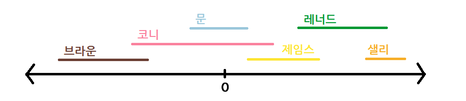

## 문제

수직선 위에 N개의 선분들이 살고 있다. N개의 선분들은 서로 친구 관계를 맺기 시작했다.

선분들 중 오직 영역이 겹치는 선분끼리만 대화를 할 수 있었기 때문에 이들끼리만 친구가 되었다. 위 그림을 참고하면 브라운과 코니는 친구가 되었고 문과 제임스도 친구가 되었지만 브라운과 샐리는 친구가 되지 못했다.

N개의 선분들은 갑자기 자신들이 얼마나 가까운 사이인지 확인해보려고 한다. 문과 레너드는 친구가 아니지만, 제임스가 문과 레너드와 친하므로 문은 레너드의 친구의 친구이다. 비슷하게, 브라운은 샐리의 친구의 친구의 친구의 친구이다. 일반적인 친구 관계를 1만큼 가깝다고 하면, 문과 레너드는 2만큼 가깝고, 브라운과 샐리는 4만큼 가깝다. 문은 코니의 친구의 친구지만, 코니의 친구이기도 하므로 문과 코니는 1만큼 가깝다.

선분 마을의 시장인 당신은, 두 명의 선분이 ‘우리가 얼마나 가까운 사이야?’라고 물어볼 때마다 바로 ‘너희 둘은 OO만큼 가까워’라고 답해야 한다. 당신은 이 업무를 자동화해서 수행해주는 프로그램을 작성해야 한다.

## 입력

첫째 줄에 선분의 수 N이 주어진다. (2 ≤ N ≤ 150,000)

둘째 줄부터 N개의 줄에 1~N번 선분의 왼쪽 끝 좌표 Li와 오른쪽 끝 좌표 Ri가 주어진다. (-1,000,000 ≤ Li ≤ Ri ≤ 1,000,000)

N+2번째 줄에는 질문의 수 Q가 주어진다. (1 ≤ Q ≤ 150,000)

N+3번째 줄부터 Q개의 줄에는 질문을 하는 두 선분의 번호 A, B가 주어진다. (1 ≤ A, B ≤ N, A ≠ B)

## 출력

Q개의 줄에 걸쳐 두 선분이 가까운 정도를 출력한다. 만약, 두 선분 사이의 친구 관계가 단절되었다면 -1을 출력한다.
