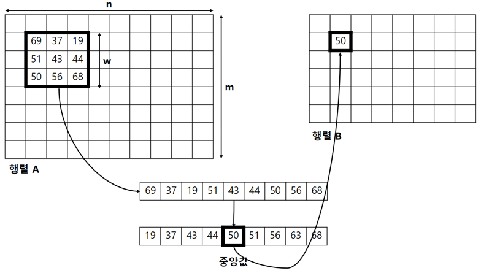

## 문제

갑과 을은 사귀는 사이입니다. 둘은 근사한 저녁을 먹기로 했습니다. 갑과 을은 저녁에 크림 치즈 스파게티를 먹으러 서\*앤\*이라는 식당에 들어갔습니다. 먹음직스러운 크림 치즈 스파게티를 보고 예쁘다는 생각이 든 갑은, 스마트폰을 들어 스파게티 사진을 찍었습니다. 그리고 갑은 SNS중 하나인 인\*타\*램에 사진을 올리려 하였는데, 그때 사진 속 스파게티 위에 뿌려진 소금과 후추가 갑의 눈에 띄었습니다.

갑은 소금과 후추가 마음에 들지 않았습니다. 사진 속에서 소금과 후추 부분을 제거하고 싶었던 갑은 을에게 사진 속 소금과 후추를 제거해줄 수 있냐고 물었습니다. 을은 바로 해줄 수 있다고 자신감 넘치게 대답하고는 가방에서 A4용지와 펜을 꺼냈습니다. 그리고 사진 속 소금과 후추를 제거해 줄 방법을 고민하기 시작했습니다. 을은 먼저 문제를 정의하여 A4용지에 다음과 같이 정리하였습니다.

* 입력으로 사진을 나타내는 MxN 행렬 A 가 주어진다. 행렬의 각 원소는 사진 속 한 픽셀의 밝기를 나타내는데, 0이면 가장 어두운 것을 의미하고, K 면 가장 밝은 것을 의미한다.
* 또 다른 입력으로 정수 W 가 주어진다. W 를 이용해 행렬 B 를 아래와 같이 정의한다.
  + B[i][j] = median(A[i+x][j+y]),
  + where 1 ≤ i ≤ M-W+1, 1 ≤ j ≤ N-W+1, 0 ≤ x, y < W
  + (A[i+x][j+y]  는 행렬 A 의 i+x 행 j+y열에 위치한 원소, median 은 중앙값\*)
* 주어진 행렬 A와 정수 W를 이용하여 행렬 B를 구한다.

<행렬 A와 W로 행렬 B가 만들어지는 과정>

을은 위의 문제를 컴퓨터 프로그램으로 해결하기 위해 가방에서 노트북을 꺼내 식탁 위에 펼쳤습니다. 을은 프로그램을 작성하기 시작했습니다. 하지만 잘 되지 않았고 스파게티는 불기 시작했습니다. 스파게티가 모두 불어 버리기 전에, 을을 위해 위의 문제를 해결하는 프로그램을 작성해주세요!

(중앙값\*: 중앙값은 어떤 주어진 값들을 크기의 순서대로 정렬했을 때 가장 중앙에 위치하는 값을 의미합니다. 예를 들어, 1, 2, 3, 3, 100의 다섯 값이 있을 때, 3이 가장 중앙에 있기 때문에 3이 중앙값입니다.)

## 입력

첫 번째 줄에는 행렬의 크기를 나타내는 정수 M 과 N(1 ≤ M, N ≤ 300), 최고 밝기 K(1 ≤ K ≤ 100,000), 정수 W(1 ≤ W ≤ min(M, N))가 공백으로 구분되어 차례로 주어진다. (단, W는 홀수) 두 번째 줄부터 1+M 번째 줄까지, 각 줄마다 N 개의 0이상 K 이하 정수가 주어진다. 입력의 1+i번째 줄의 j번째 정수는 행렬 A 의 i번째 행, j번째 열에 위치한 원소를 의미한다.

## 출력

M-W+1줄에 걸쳐 정답 행렬 B를 출력한다.

## 힌트

예제1에서, w = 1, median(1) = 1, median(2) = 2, …, median(9) = 9 이므로 입력된 행렬과 동일한 행렬이 답입니다.

예제2에서 w = 3 이므로 median(1, 2, 3, 4, 5, 6, 7, 8, 9) = 5가 답입니다.

예제3 정답 행렬의 1행 1열에 위치한 8은 median(5, 1, 2, 12, 10, 3, 8, 12, 19) = 8 연산 과정을 통해 얻어졌습니다.
