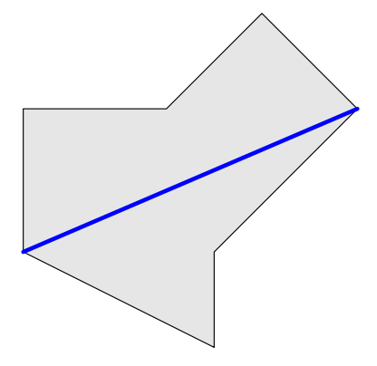

## 문제

The tropical island nation of Piconesia is famous for its beautiful beaches, lush vegetation, cocoa and coffee plantations, and wonderful weather all year round. This paradise is being considered as a future location for the World Finals of the ACM International Collegiate Programming Contest (or at the very least a vacation spot for the executive council). There is only one small problem: the island is really hard to reach.

Currently, the fastest way to reach the island takes three days from the nearest airport, and uses a combination of fishing boat, oil tanker, kayak, and submarine. To make attending the ICPC World Finals slightly easier and to jump-start the island’s tourism business, Piconesia is planning to build its first airport.

Since longer landing strips can accommodate larger airplanes, Piconesia has decided to build the longest possible landing strip on their island. Unfortunately, they have been unable to determine where this landing strip should be located. Maybe you can help?

For this problem we model the boundary of Piconesia as a polygon. Given this polygon, you need to compute the length of the longest landing strip (i.e., straight line segment) that can be built on the island. The landing strip must not intersect the sea, but it may touch or run along the boundary of the island. Figure A.1 shows an example corresponding to the first sample input.

Figure A.1: The island modeled as a polygon. The longest possible landing strip is shown as a thick line.

## 입력

The input starts with a line containing an integer n (3 ≤ n ≤ 200) specifying the number of vertices of the polygon. This is followed by n lines, each containing two integers x and y (|x|, |y| ≤ 106) that give the coordinates (x, y) of the vertices of the polygon in counter-clockwise order. The polygon is simple, i.e., its vertices are distinct and no two edges of the polygon intersect or touch, except that consecutive edges touch at their common vertex. In addition, no two consecutive edges are collinear.

## 출력

Display the length of the longest straight line segment that fits inside the polygon, with an absolute or relative error of at most 10−6.
