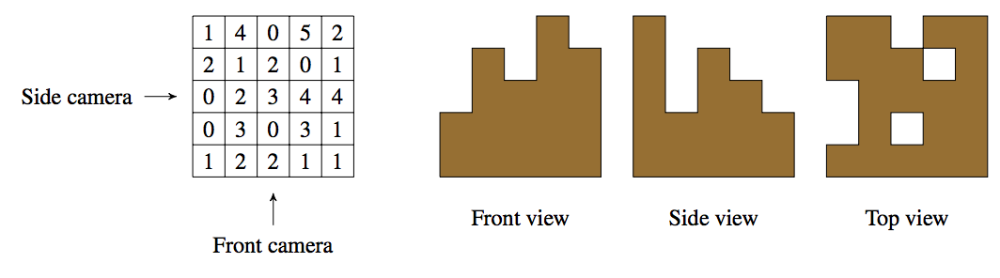
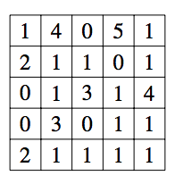

## 문제

It is a sunny day in spring and you are about to meet Patrick, a close friend and former partner in crime. Patrick lost most of his money betting on programming contests, so he needs to pull off another job. For this he needs your help, even though you have retired from a life of crime. You are reluctant at first, as you have no desire to return to your old criminal ways, but you figure there is no harm in listening to his plan.

There is a shipment of expensive consumer widgets in a nearby warehouse and Patrick intends to steal as much of it as he can. This entails finding a way into the building, incapacitating security guards, passing through various arrays of laser beams – you know, the usual heist techniques. However, the heart of the warehouse has been equipped with a security system that Patrick cannot disable. This is where he needs your help.

The shipment is stored in large cubical crates, all of which have the same dimensions. The crates are stacked in neat piles, forming a three-dimensional grid. The security system takes pictures of the piles once per hour using three cameras: a front camera, a side camera and a top camera. The image from the front camera shows the height of the tallest pile in each column, the image from the side camera shows the height of the tallest pile in each row, and the image from the top camera shows whether or not each pile is empty. If the security system detects a change in any of the images, it sounds an alarm.

Once Patrick is inside, he will determine the heights of the piles and send them to you. Figure C.1 shows a possible layout of the grid and the view from each of the cameras.

Figure C.1: Grid of heights and the corresponding camera views.

Figure C.2: Possible grid of heights after the heist

Patrick wants to steal as many crates as possible. Since he cannot disable the security system, he plans to fool it by arranging the remaining crates into piles so that the next set of camera images are the same. In the above example, it is possible to steal nine crates. Figure C.2 shows one possible post-heist configuration that appears identical to the security system.

Patrick asks you to help him determine the maximum number of crates that can be stolen while leaving a configuration of crates that will fool the security system. Will you help him pull off this final job?

## 입력

The first line of input contains two integers r (1 ≤ r ≤ 100) and c (1 ≤ c ≤ 100), the number of rows and columns in the grid, respectively. Each of the following r lines contains c integers, the heights (in crates) of the piles in the corresponding row. All heights are between 0 and 109 inclusive.

## 출력

Display the maximum number of crates that can be stolen without being detected.
