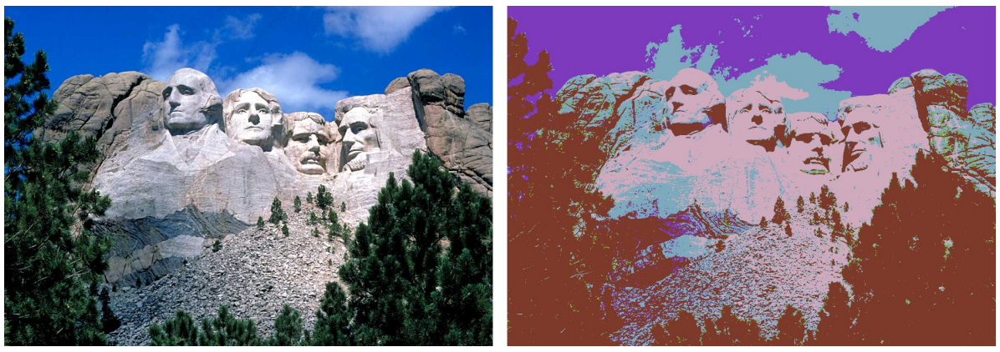

## 문제

Pixels in a digital picture can be represented with three integers in the range 0 to 255 that indicate the intensity of the red, green, and blue colors. To compress an image or to create an artistic effect, many photo-editing tools include a “posterize” operation which works as follows. Each color channel is examined separately; this problem focuses only on the red channel. Rather than allow all integers from 0 to 255 for the red channel, a posterized image allows at most k integers from this range. Each pixel’s original red intensity is replaced with the nearest of the allowed integers. The photo-editing tool selects a set of k integers that minimizes the sum of the squared errors introduced across all pixels in the original image. If there are n pixels that have original red values r1, . . . , rn, and k allowed integers v1, . . . , vk, the sum of squared errors is defined as

\(\sum\_{i=1}^{n}{\min\_{1 \le j \le k}{(r\_i - v\_j)^2}}\).

Your task is to compute the minimum achievable sum of squared errors, given parameter k and a description of the red intensities of an image’s pixels.

## 입력

The first line of the input contains two integers d (1 ≤ d ≤ 256), the number of distinct red values that occur in the original image, and k (1 ≤ k ≤ d), the number of distinct red values allowed in the posterized image. The remaining d lines indicate the number of pixels of the image having various red values. Each such line contains two integers r (0 ≤ r ≤ 255) and p (1 ≤ p ≤ 226), where r is a red intensity value and p is the number of pixels having red intensity r. Those d lines are given in increasing order of red value.

## 출력

Display the sum of the squared errors for an optimally chosen set of k allowed integer values.
