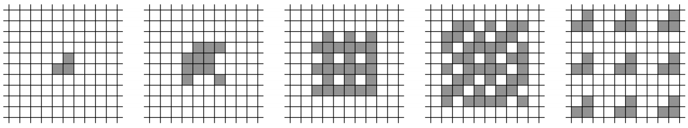
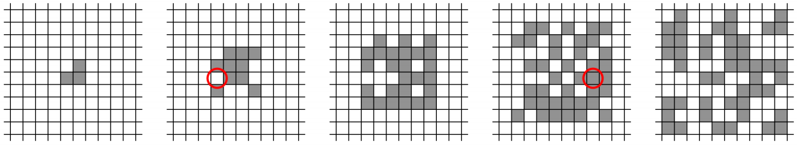

## 문제

The owner of the Automatic Cellular Manufacturing corporation has just patented a new process for the mass production of identical parts. Her approach uses a two-dimensional lattice of two-state cells, each of which is either “empty” or “filled.” The exact details are, of course, proprietary.

Initially, a set of cells in the lattice is filled with a copy of the part that is to be reproduced. In a sequence of discrete steps, each cell in the lattice simultaneously updates its state by examining its own state and those of its eight surrounding neighbors. If an odd number of these nine cells are filled, the cell’s state in the next time step will be filled, otherwise it will be empty. Figure G.1 shows several steps in the replication process for a simple pattern consisting of three filled cells.

Figure G.1: The replication process.

However, a bug has crept into the process. After each update step, one cell in the lattice might spontaneously flip its state. For instance, Figure G.2 shows what might happen if a cell flipped its state after the first time step and another flipped its state after the third time step.

Figure G.2: Errors in the replication process. This figure corresponds to Sample Input 1.

Unfortunately, the original patterns were lost, and only the (possibly corrupted) results of the replication remain. Can you write a program to determine a smallest possible nonempty initial pattern that could have resulted in a given final pattern?

## 입력

The first line of input contains two integers w (1 ≤ w ≤ 300) and h (1 ≤ h ≤ 300), where w and h are the width and height of the bounding box of the final pattern. Following that are h lines, each containing w characters, giving the final pattern. Each character is either ‘.’ (representing an empty cell) or ‘#’ (representing a filled cell). There is at least one filled cell in the first row, in the last row, in the first column, and in the last column.

## 출력

Display a minimum-size nonempty pattern that could have resulted in the given pattern, assuming that at each stage of the replication process at most one cell spontaneously changed state. The size of a pattern is the area of its bounding box. If there is more than one possible minimum-size nonempty starting pattern, any one will be accepted. Use the character ‘.’ for empty cells and ‘#’ for filled cells. Use the minimum number of rows and columns needed to display the pattern.
