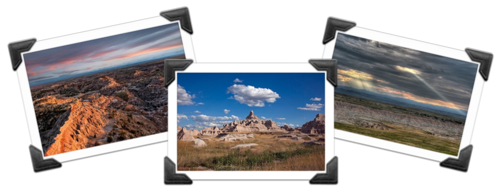

## 문제

Images by John Fowler, Carol Highsmith, and Richard Woodland

You have decided to spend a day of your trip to Rapid City taking photographs of the South Dakota Badlands, which are renowned for their spectacular and unusual land formations. You are an amateur photographer, yet very particular about lighting conditions.

After some careful research, you have located a beautiful location in the Badlands, surrounded by picturesque landscapes. You have determined a variety of features that you wish to photograph from this location. For each feature you have identified the earliest and latest time of day at which the position of the sun is ideal. However, it will take quite a bit of time to take each photograph, given the need to reposition the tripod and camera and your general perfectionism. So you are wondering if it will be possible to successfully take photographs of all these features in one day.

## 입력

The first line of the input contains two integers n (1 ≤ n ≤ 104) and t (1 ≤ t ≤ 105), where n is the number of desired photographs and t is the time you spend to take each photograph. Following that are n additional lines, each describing the available time period for one of the photographs. Each such line contains two nonnegative integers a and b, where a is the earliest time that you may begin working on that photograph, and b is the time by which the photograph must be completed, with a + t ≤ b ≤ 109.

## 출력

Display yes if it is possible to take all n photographs, and no otherwise.
