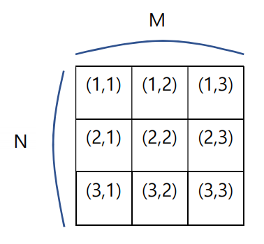

## 문제

영정이는 숭실대 학교 앞, 원룸에서 자취를 한다. 원룸 자취방 방바닥에는 곰팡이가 서식하고 있는데, 곰팡이는 시간이 지날 때 마다 증식을 한다. 영정이의 자취방에서 서식하는 곰팡이는 특이한 방식으로 증식하는데, 어떤 한 지점에 곰팡이가 있었다면 그 위치에서 대각선 위 아래로 곰팡이가 증식되고 원래 곰팡이가 있던 자리는 곰팡이가 사라지게 된다. 아래 2번 그림과 같이 곰팡이가 사라지는 지점이자 다시 증식되는 지점이면 곰팡이는 증식된다.

1번 예

2번 예

영정이는 매우 게으름이 많아 미래에 이 곰팡이가 자신의 집을 모두 뒤덮는 시점이 한번이라도 생길 것으로 예측되면 대청소를 하려고 한다. 영정이의 집의 크기와, 현재 곰팡이의 위치가 주어질 때, 영정이가 청소를 해야 하는지 안 해도 되는지 알려주자.

## 입력

프로그램의 입력은 표준 입력으로 받는다. 입력의 첫 줄에는 영정이의 자취방 바닥의 크기 N과 M, 그리고 바닥에 있는 곰팡이의 개수 K가 주어진다. (2 ≤ N, M ≤ 1,000) (1 ≤ K ≤ 100,000) 둘째 줄부터 K줄에 걸쳐 현재 곰팡이의 위치 x, y가 주어진다. 좌표계는 행렬 좌표계와 일치한다. (1 ≤ x ≤ N) (1 ≤ y ≤ M) 곰팡이는 중복되지 않는 위치에 주어진다.

## 출력

프로그램의 출력은 표준 출력으로 한다. 영정이가 청소를 해야 한다면 ‘YES’를 청소를 하지 않아도 된다면 ‘NO’를 출력하자.
