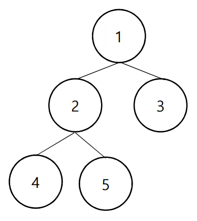

## 문제

영우는 운동장에 크게 ‘트리’ 그림을 그려 놓으며 공부를 하고 있었다. ‘트리’ 란, 사이클이 없는 그래프를 뜻한다. 우연히 지나가던 영선이는 트리의 정점 크기가 정확히 자신의 발 사이즈와 일치 하는 것을 알게 되었고, 그걸 본 영우는 영선이에게 게임을 제안했다. 게임의 방식은 다음과 같다.

영선이가 임의의 한 정점에서 시작해서 왼 발, 오른 발을 번갈아 걷다가 더 이상 갈 수 없을 때까지 게임을 진행한다. 영선이는 왼 쪽 발을 디딘 채로 시작한다. 더 이상 진행할 수 없을 때 정점을 밟고 있는 발이 왼 발이면 영선이가 이기고, 오른 발이면 영우가 이긴다. 단, 영선이가 한 번 밟은 정점은 영선이의 발자국으로 인해 운동장에서 지워진다.

영선이는 운동장이 너무 커서 트리에 대한 정보를 하나도 모르기 때문에, 게임을 시작 할 정점을 찍어야 한다. 자신이 불리하다고 생각한 영선이가 게임을 하지 않으려고 하자, 영우는 영선이에게 “어떤 점 x에서 영선이가 이기는 경우의 수”를 알려주며 어그로를 끌어보려고 한다. 최대한 큰 값을 얘기하고 싶은 영우를 위해 트리 정보를 다 알고있는 여러분이 계산해주자.

예를 들어 운동장에 다음과 같은 트리 그림이 그려져 있었다고 하자.

1번에서 왼 발을 디딘 채로 시작해서 영선이가 이길 수 있는 경우의 수는 2다.

(1왼 -> 2오 -> 4왼) (1왼 ->2오 -> 5왼)

2번에서 왼 발을 디딘 채로 시작해서 영선이가 이길 수 있는 경우의 수는 1이다.

(2왼 -> 1오 -> 3왼)

## 입력

프로그램의 입력은 표준 입력으로 받는다. 입력의 첫 줄에는 정점의 개수 N이 주어진다. (1 ≤ N ≤ 1,000,000) 두 번째 줄부터 N-1개의 줄에 정점 a와 정점 b가 주어진다. (1 ≤ a, b ≤ N) 정점 a와 정점 b가 연결 되어 있다는 것을 의미한다.

## 출력

프로그램의 출력은 표준 출력으로 한다. 경우의 수가 최대인 위치에서의 경우의 수를 출력한다.
