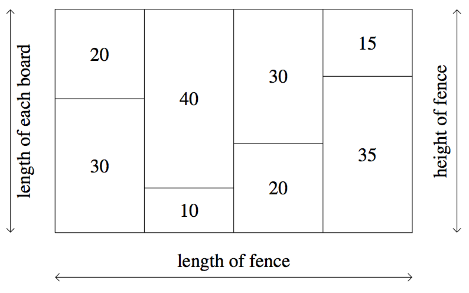

## 문제

Tudor is a contestant in the Canadian Carpentry Challenge (CCC). To win the CCC, Tudor must demonstrate his skill at nailing wood together to make the longest fence possible using boards. To accomplish this goal, he has N pieces of wood. The ith piece of wood has integer length Li.

A board is made up of exactly two pieces of wood. The length of a board made of wood with lengths Li and Lj is Li + Lj. A fence consists of boards that are the same length. The length of the fence is the number of boards used to make it, and the height of the fence is the length of each board in the fence. In the example fence below, the length of the fence is 4; the height of the fence is 50; and, the length of each piece of wood is shown:

Tudor would like to make the longest fence possible. Please help him determine the maximum length of any fence he could make, and the number of different heights a fence of that maximum length could have.

## 입력

The first line will contain the integer N (2 ≤ N ≤ 1 000 000).

The second line will contain N space-separated integers L1, L2, . . . , LN (1 ≤ Li ≤ 2 000).

For 7 of the 15 available marks, N ≤ 100.

For an additional 6 of the 15 available marks, N ≤ 1000.

For an additional 1 of the 15 available marks, N ≤ 100 000.

## 출력

Output two integers on a single line separated by a single space: the length of the longest fence and the number of different heights a longest fence could have.

## 힌트

Explanation for Output for Sample Input 1

Tudor first combines the pieces of wood with lengths 1 and 4 to form a board of length 5. Then he combines the pieces of wood with lengths 2 and 3 to form another board of length 5. Finally, he combines the boards to make a fence with length 2 and height 5.

Explanation for Output for Sample Input 2

Tudor can’t make a fence longer than length 1, and there are 10 ways to make a fence with length 1 by choosing any two pieces of wood to nail together. Specifically, he may have a fence of height 11, 101, 1001, 2001, 110, 1010, 2010, 1100, 2100 and 3000.
