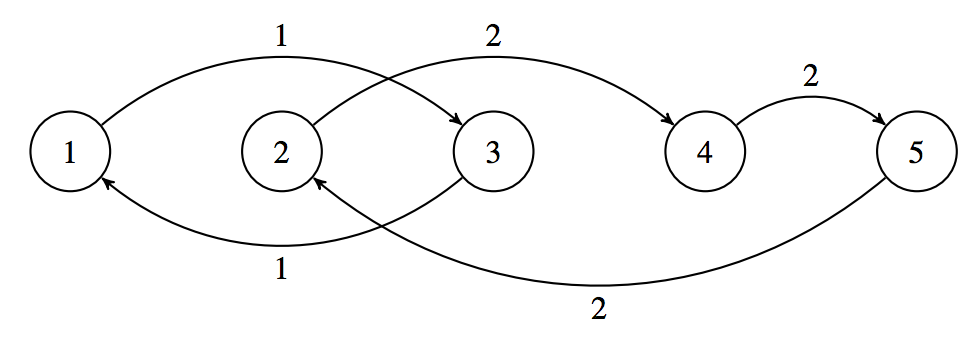
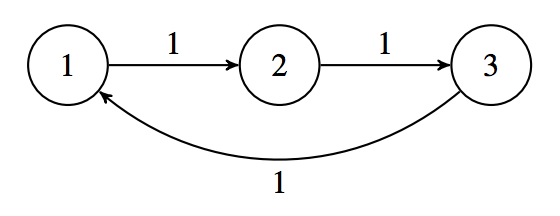

## 문제

The Rail Metro Transit (RMT) operates a very unusual subway system. There are N subway stations numbered from 1 to N. There are M subway lines numbered from 1 to M, with each station belonging to exactly one line and at least one station per line. The subway lines are circular. That is, if a station is numbered S, the next station after S is the station on the same line with the next largest number, unless S is the greatest number of a station in the line, in which case the next station after S is the station on the same line with the least number.

RMT is conducting a load test of their system using volunteer passengers to ride the subway trains. The test begins with one subway train in each station and for every i, there are Ai passengers in the train at station i. The volunteers do not leave their assigned trains throughout the entire duration of the load test.

Throughout the test, RMT will perform Q actions. Each of the Q actions is one of two types: either they will survey the total number of passengers in the trains at the stations numbered from l to r; or they will operate all the trains on some line x. When a train on line x is operated, it goes to the next station in that line.

You are RMT’s biggest fan, so you have generously volunteered to keep track of RMT’s actions and report the answers to their surveys.

## 입력

The first line will contain three space-separated integers N, M, and Q (1 ≤ M ≤ N ≤ 150 000; 1 ≤ Q ≤ 150 000). The second line will contain the subway line numbers that each station from 1 to N belongs to: L1, L2, . . . , LN. The third line will contain N integers A1, A2, . . . , AN (1 ≤ Ai ≤ 7 000) representing the initial number of passengers at each station from 1 to N.

The next Q lines will each have one of the following forms:

* 1 l r, which represents a survey (1 ≤ l ≤ r ≤ N).
* 2 x, which represents RMT operating line x (1 ≤ x ≤ M).

For 2 of the 15 available marks, N ≤ 1 000 and Q ≤ 1 000.

For an additional 2 of the 15 available marks, Li ≤ Li+1 (1 ≤ i < N).

For an additional 3 of the 15 available marks, M ≤ 200.

For an additional 3 of the 15 available marks, there will be no more than 200 trains on any single line.

## 출력

For every survey, output the answer to the survey on a separate line.

## 힌트

Explanation for Output for Sample Input 1

The subway system is illustrated below, with the stations numbered from 1 to 5 and the lines connecting stations marked as either being line 1 or line 2:

Initially, the number of passengers at each station is {1, 2, 3, 4, 5}.

The answer to the first survey is 1 + 2 + 3 + 4 + 5 = 15.

After line 1 is operated, the number of passengers at each station is {3, 2, 1, 4, 5}.

The answer to the second survey is 1 + 4 + 5 = 10.

After line 2 is operated, the number of passengers at each station is {3, 5, 1, 2, 4}.

The answer to the third survey is 3 + 5 + 1 = 9.

Explanation for Output for Sample Input 2

The subway system is illustrated below, with the stations numbered from 1 to 3 and the lines connecting stations marked as all being line 1:

Just before the first survey, the number of passengers at each station is {114, 101, 109}.

Just before the second survey, the number of passengers at each station is {109, 114, 101}.

Just before the third survey, the number of passengers at each station is {101, 109, 114}.

Just before the fourth survey, the number of passengers at each station is {114, 101, 109}.
