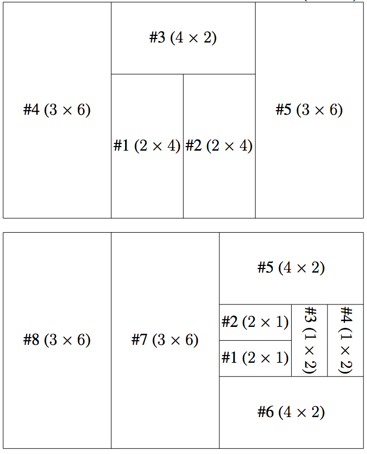

## 문제

Long ago, in the land of Cartesia, there ruled the Rectangle Empire. The Empire was large and prosperous, and it had great success with expanding its territory through frequent conquests. The citizens of this ancient civilization followed many curious customs. Unfortunately, the significance of these are now shrouded in mystery.

The Rectangle Empire operated under a system of rectangular districts. These districts were carefully managed to meet three special criteria.

1. The Empire’s territory is divided into districts such that each piece of land controlled by the Empire belongs to exactly one district.
2. The boundaries of the districts, when viewed on a map, must be rectangles such that the length of the longer side of the rectangle is twice the length of the shorter side.
3. The side lengths of the districts must be integers, when measured in Ξ (note that Ξ was the primary unit of length in the Rectangle Empire).

When the empire was first established, it consisted of a single district. Since then, the empire has gained additional districts through conquest of neighbouring regions. Whenever the empire gained control over a new region of land, they always established a single new district using that exact land. This means that the empire was always mindful about the geometric properties of the land they were hoping to conquer. You can assume that no two of these conquests occurred at the same time.

The addition of new districts was the only way that the boundaries of the empire ever changed. Furthermore, each district, once added, was never modified or merged with another.

The final, most important tradition of the Rectangle Empire was to make sure that the overall territory of the empire was always a rectangle, though it did not necessarily need to satisfy the 2:1 ratio for the side lengths that individual districts satisfy.

Recently, archeologists have discovered that at one point in time, the empire had dimensions N by M (measured in Ξ). You need not be alarmed if these numbers are very large; after all, Cartesia is an infinite plane. Your task is to estimate the number of districts in the empire when it was at this size. Over all possible ways that the empire was founded and expanded, what is the minimum and maximum number of districts?

## 입력

The input will be a single line, containing two integers N and M (1 ≤ N, M ≤ 108).

For 5 of the 25 marks available, N, M ≤ 1000.

For an additional 8 of the 25 marks available, N, M ≤ 106.

## 출력

Output a single line, containing the minimum number of districts, followed by a space, followed by the maximum number of districts.

## 힌트

Explanation of Output for Sample Input

The illustrations below show how this minimum and maximum number of districts could have been achieved. Districts are labelled #1, #2, #3, ... giving the order in which they were added to the region. The dimensions of each district is shown in brackets as (k × 2k) or (2k × k):

