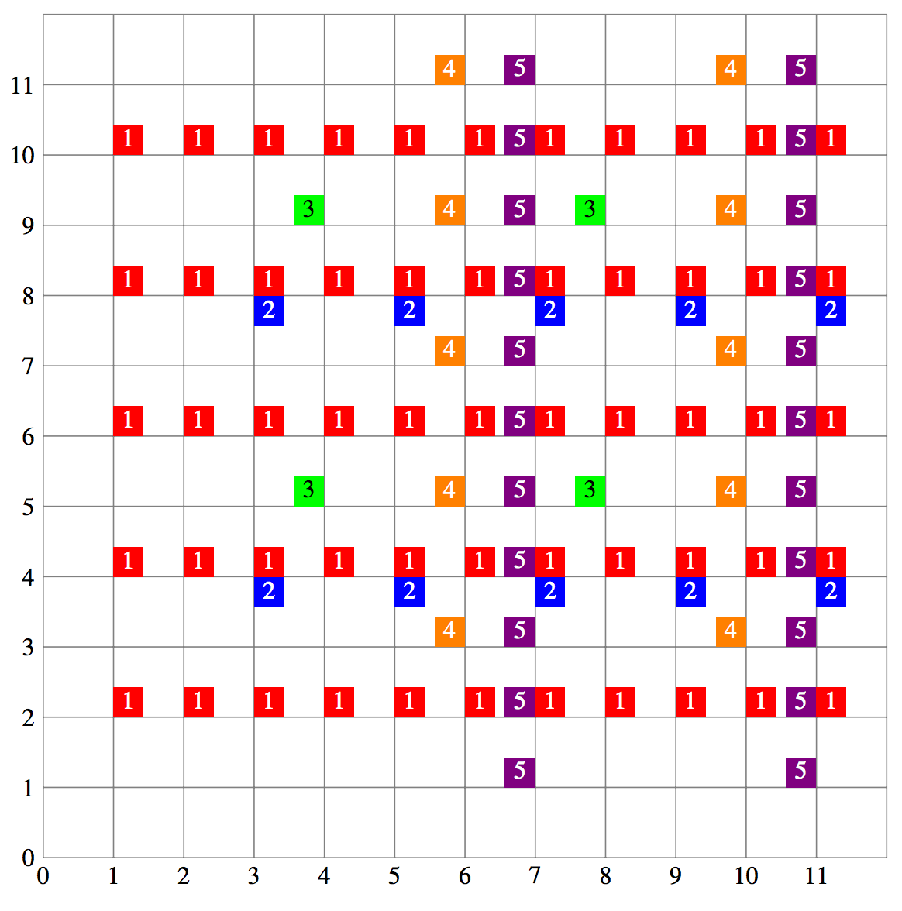

## 문제

After being inspired by the great painter Picowso, Vera decided to make her own masterpiece. She has an empty painting surface which can be modeled as an infinite 2D coordinate plane. Vera likes powers of two (1, 2, 4, 8, 16, . . .) and will paint some some points in a repeated manner using step sizes which are a power of two.

Vera will paint N times. The i-th time can be described by three integers xi, yi, vi. Let ai be the largest power of two not greater than xi and let bi be the largest power of two not greater than yi. Vera will add a paint drop with colour vi to all points that are of the form (xi +aip, yi +biq), where p, q are non-negative integers. A point may have multiple paint drops on it or have multiple drops of the same colour.

Then Vera will ask Q questions. For the j-th question she wants to know the colour at the point (rj, cj). The colour at a point is equal to the sum of the colours of all paint drops at that point. If there are no paint drops at a point, the colour of that point is 0.

Since you are forced to be her art assistant, you will have to answer Vera’s questions.

## 입력

The first line contains two integers N, Q, separated by one space (1 ≤ N, Q ≤ 2 · 105).

The next N lines each contain three space-separated integers, xi, yi, vi representing the paint drops of colour vi (1 ≤ i ≤ N; 1 ≤ vi ≤ 10 000; 1 ≤ xi, yi ≤ 1018).

The next Q lines each contain two space-separated integers rj, cj, representing the Q questions about the point (rj, cj) (1 ≤ j ≤ Q; 1 ≤ rj ≤ 1018; 1 ≤ cj ≤ 1018).

For 5 of the 25 available marks, N, Q ≤ 2000.

For an additional 5 of the 25 available marks, yi = 1 (1 ≤ i ≤ N).

For an additional 5 of the 25 available marks, N, Q ≤ 105 and 1 ≤ rj, cj ≤ 109 (1 ≤ j ≤ Q).

## 출력

The output will be Q lines. The j-th line (1 ≤ j ≤ Q) should have one integer, which is the colour of point (rj, cj).

## 힌트

Explanation of Output for Sample Input

Let colour 1, 2, 3, 4, 5 be red, blue, green, orange, purple respectively.

Let p, q be non-negative integers, then:

* Points (1 + p, 2 + 2q) have a red paint drop.
* Points (3 + 2p, 4 + 4q) have a blue paint drop.
* Points (4 + 4p, 5 + 4q) have a green paint drop.
* Points (6 + 4p, 3 + 2q) have a orange paint drop.
* Points (7 + 4p, 1 + q) have a purple paint drop.

The painting from (0, 0) to (11, 11) is shown on the next page:

We can see that:

* (2, 6) has a red paint drop, so it has colour 1.
* (7, 8) has a red, blue and purple paint drop, so it has colour 1 + 2 + 5 = 8.
* (5, 9) has no paint drops, so it has colour 0.
* (11, 2) has a red and purple paint drop, so it has colour 1 + 5 = 6.
* (10, 7) has a orange paint drop, so it has colour 4.
* (4, 5) has a green paint drop, so it has colour 3.

