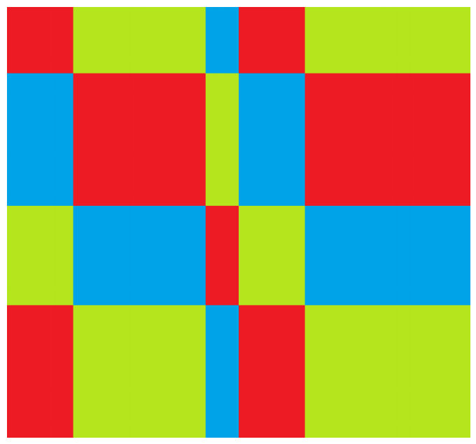

## 문제

상수는 N행 M열의 격자에 L가지 색으로 그림을 그린다. 1행에서 시작해서 N행까지, 같은 행에서는 1열에서 시작해서 M열까지 순서대로 칠하는데, 1번 색부터 시작해서 L번 색까지 순서대로 사용한 뒤 다시 1번 색부터 사용한다. i번째 행의 높이는 Hi이고 j번째 열의 너비는 Wj이다. 상수는 물감을 낭비하고 싶지 않기 때문에, 그림을 그리기 전에 각 색이 얼마나 필요한지가 궁금해졌다. 상수를 위해 각 색으로 칠할 넓이가 얼마나 되는 지 구해보자.

## 입력

첫 번째 줄에 N, M, L가 주어진다. (1 ≤ N, M, L ≤ 123,456)

두 번째 줄에 각 행의 높이를 나타내는 N개의 자연수 Hi가 공백을 사이에 두고 주어진다. Hi의 합은 109을 넘지 않는다. (1 ≤ i ≤ N)

세 번째 줄에 각 열의 너비를 나타내는 M개의 자연수 Wj가 공백을 사이에 두고 주어진다. Wj의 합은 109을 넘지 않는다. (1 ≤ j ≤ M)

## 출력

L줄에 걸쳐 k번째 줄에 k번 색으로 칠할 넓이를 출력한다.

## 힌트

상수가 그릴 그림은 다음처럼 생겼다.

