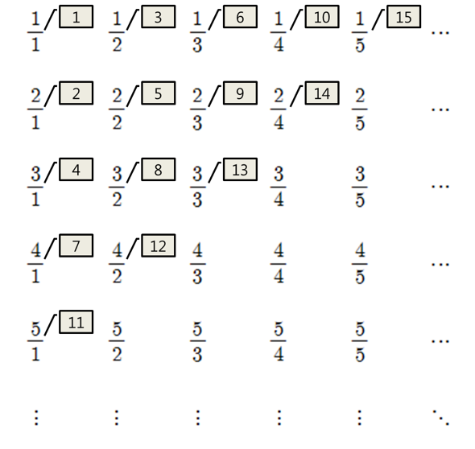

## 문제

민호는 이산수학 강의를 듣는다.

어느 날 교수님께서 Positive rational numbers are countable에 대해 증명해 주시고, 역시나 과제를 내주셨다.

양의 유리수는 다음 그림처럼 열거할 수 있다.

첫 번째 유리수는 1/1, 두 번째 유리수는 2/1, 세 번째 유리수는 1/2, 네 번째 유리수는 3/1, 다섯 번째 유리수는 2/2, ... 이다.

1/1, 2/2, 3/3, ... 은 다르게 취급 하는것에 유의하여야 한다.

위 그림처럼 모든 유리수에 순차적으로 번호를 붙였을 때, N번째 유리수를 구하여라.

 과제가 하기 싫은 민호는 컴공과답게 N번째 유리수를 구하는 프로그램을 만들려고 한다.

## 입력

첫 번째 줄에 양의 정수 N이 주어진다. (1 ≤ N ≤ 1000)

## 출력

N번째 유리수가 a/b일 때, 분자 a, 분모 b를 공백으로 구분하여 a, b를 출력하여라.

## 힌트

과제가 하기 싫었던 민호는 실제로 이 과제를 프로그램으로 만들어 식을 유도했다고 한다.
