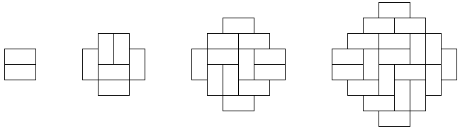
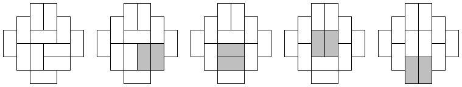

## 문제

재민이는 1x2의 벽돌로 이루어진 마름모 형태의 고대 문양을 발견했다.

하지만 가로와 세로 벽돌이 불규칙적으로 놓여 있는 것이 마음에 안 들었던 재민이는 모든 벽돌을 세로로 만들려고 한다. 재민이는 손이 작아서 한 손으로 벽돌을 들 수 없고, 두 손 사이에 벽돌을 끼워서 두 개의 벽돌을 들 수는 있다. 그래서 두 벽돌로 이루어진 2x2 정사각형을 하나 고르고 90도 회전시키는 작업만 가능하다.

프로그래밍 대회가 곧 시작되기 때문에 여기에 너무 많은 시간을 쓰고 싶지는 않다. 재민이를 도와 주자!

## 입력

첫 번째 줄에 문양의 크기 N이 주어진다. N은 1 이상 100 이하이다. 다음 2N줄에는 문양의 행을 나타내는 길이 2N의 문자열이 주어진다. “.”은 공백, “L”과 “R”은 가로 벽돌의 좌우 칸, “U”와 “D”는 세로 벽돌의 상하 칸을 나타낸다.

## 출력

첫 번째 줄에 모든 벽돌을 세로로 만들기 위해 필요한 회전의 횟수 D를 출력한다. 이 값은 N^4 이하여야 한다. 다음 D줄에는 회전할 2x2 정사각형의 왼쪽 위 칸의 행 번호와 열 번호를 출력한다. 맨 위 행과 맨 왼쪽 열의 번호는 1이다. 입력 조건을 만족하는 모든 입력에 대해 답의 존재가 보장된다.
