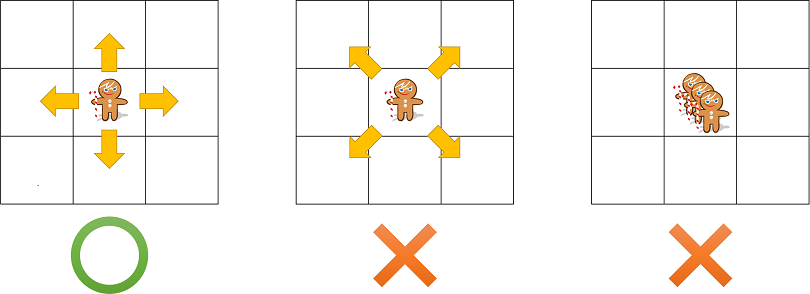
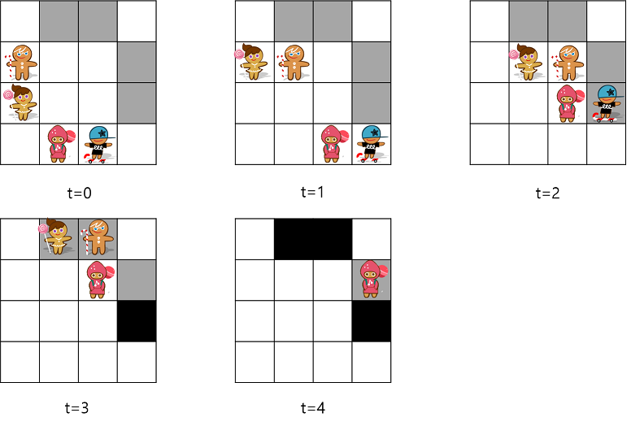

## 문제

어느 날 과자 공장을 침략한 마녀가 쿠키들을 납치해 오븐에 가두었다. 오븐의 바닥은 격자로 이루어져 있고, 쿠키는 오븐 안에서 상하좌우로 한칸씩 자유롭게 움직이거나 가만히 있을 수 있다. 하지만 쿠키가 모여 있으면 마녀가 의심하기 때문에 한 칸에 한 쿠키만 있을 수 있다.

쿠키를 사랑하는 당신은 쿠키들을 구출하려고 한다. 조사를 통해 바닥의 몇몇 칸이 부실한 것을 발견했고, 이 곳으로 쿠키를 탈출시키려 한다. 다행히도 딱 탈출해야 되는 쿠키의 개수만큼 부실한 칸이 있었다. 부실한 바닥에 쿠키가 올라가면 그 부분이 바로 무너져 내리며 구멍을 통해 탈출할 수 있다. 다만 한번 어떤 칸으로 탈출하고 나면 더 이상 쿠키가 그 구멍으로 나가지 못하게 마녀가 마법으로 장애물을 만들기 때문에 최대 하나의 쿠키만 그곳으로 탈출할 수 있다.

쿠키가 너무 분주하게 움직이면 마녀가 의심하기 때문에 모든 쿠키는 1초에 최대 한칸씩만 움직이게 하려고 한다. 모든 쿠키가 탈출하기 위해 필요한 최소 시간을 구하자.

위의 그림은 예제 1번의 경우 쿠키의 이동 경로를 나타낸 것이다. 회색 칸은 바닥이 부실한 칸이고 검은색 칸은 이미 무너졌기 때문에 장애물이 생겨 더 이상 지나다닐 수 없는 칸이다.

## 입력

첫째 줄에 격자의 높이 H, 너비 W, 쿠키와 부실한 바닥의 개수 N이 주어진다. 1 <= H, W, H\*W <= 100, 1 <= N <= H\*W/2이다. 다음 N줄에 쿠키의 위치 r과 c가 주어진다. 그 다음 N줄에 부실한 바닥의 위치 r와 c가 주어진다. 1 <= r <= H, 1 <= c <= W이고, 모든 위치는 서로 다르다.

## 출력

첫째 줄에 모든 쿠키가 탈출하는데 걸리는 최소 시간을 출력한다. 만약 모든 쿠키가 탈출하지 못한다면 -1을 출력하라.
