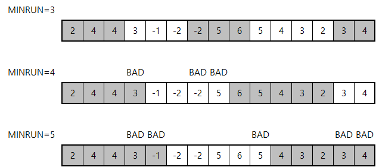

## 문제

올해부터 ACM-ICPC 월드 파이널에서 파이썬을 사용할 수 있다. 그 기념으로 파이썬에 대한 재미있는 사실 하나를 소개하고자 한다.

파이썬은 팀소트라는 정렬 알고리즘을 사용한다. 요약하면 대부분의 원소들이 순서대로 있는 부분배열로 나누고, 각 부분배열을 삽입정렬하고, 정렬된 부분배열들을 합치는 것이다. 그래서 연속된 원소들이 뭉쳐져 있을수록 정렬이 빨라진다.

그 중에서 부분배열로 나누는 과정에 주목하려고 한다.

1. 해당 위치부터 시작하여, 증가하거나 유지되는 ($a\_0 \leq a\_1 \leq a\_2 \leq ...$) 부분배열 또는 감소하는 ($a\_0 > a\_1 > a\_2 > ...$) 부분배열을 가능한 한 길게 잡는다.
2. 부분배열의 길이가 $MINRUN$보다 작으면, 뒤에 있는 원소를 더 가져와서 그 길이로 맞춘다. 이때 가져오는 원소들을 "나쁜 원소"라고 부르자. 길이가 맞춰지기 전에 배열이 끝나면 멈춘다.

$MINRUN$이 작을수록 합쳐야 될 부분배열이 많아지고, $MINRUN$이 클수록 나쁜 원소가 많아져 삽입정렬이 힘들어지므로 적당한 $MINRUN$을 잡는 것이 중요하다. 배열을 합치는 과정 때문에 $N/MINRUN$이 2의 지수에 가까워야 좋다는 조건도 있지만, 이는 이 문제에서 고려하지 않을 것이다. $MINRUN$의 값이 주어졌을 때 부분배열과 나쁜 원소의 개수를 구해 보자.

## 입력

첫 번째 줄에 배열의 길이 $N$이 주어진다.($5 \leq N \leq 100,000$) 두 번째 줄에 배열의 원소 $N$개가 주어진다. 각 원소의 절댓값은 $10^9$ 이하이다. 세 번째 줄에 쿼리의 개수 $Q$가 주어진다.($1 \leq Q \leq 100,000$) 네 번째 줄부터 $Q+3$번째 줄까지는 한 줄에 하나씩 $MINRUN$의 값이 주어진다.($2 \leq MINRUN \leq N$)

## 출력

각 쿼리마다 부분배열의 개수와 나쁜 원소의 개수를 한 줄에 출력한다.
