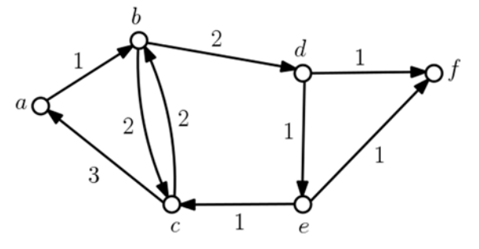

## 문제

A metabolic network is modeled as a directed graph in which a vertex represents a state and an edge represents a transition from one state to another. Each edge has a weight like a cost or an energy that needs for the transition of the edge. The mean weight of a directed cycle in the metabolic network is the total weight of its edges divided by their number. In general, the efficiency of the network is measured by the minimum mean weight of directed cycles in the network. We now want to measure the efficiency of a given metabolic network by computing the minimum mean weight.

More precisely, a digraph (directed graph) G = (V, E) of n vertices, associating each edge e with a positive weight, is given. A cycle C in G is simple if the vertices along C are all distinct. A weight w(C) of a (directed) simple cycle C in G is the total weights of the edges in C, and the *mean weight* of C is w(C)/|C|, where |C| is the number of edges of C or cycle length of C. The *minimum cycle mean* of G is the minimum mean weight of simple cycles in G. For simplicity, we assume that a digraph G is simple, that is, there is no self-loop edge from a vertex to itself, and there are no two or more edges from u to v for any distinct vertices u and v of G. Note that the length of any simple cycle in G is at least two.

Figure B.1.  A digraph G of 6 vertices and 9 edges.

For example, a digraph G in Figure B.1 has four directed simple cycles in total, b → c → b, a → b → c → a, b → d → e → c → b, and a → b → d → e → c → a, of cycle length 2, 3, 4, and 5, respectively. The weights of the cycles are 4, 6, 6, and 8, thus their means are 4/2 = 2, 6/3 = 2, 6/4 = 1.5, and 8/5 = 1.6, respectively. The cycle of the minimum mean is b → d → e → c → b and its mean is 1.5.

You write a program to output the minimum cycle mean of a simple digraph G.

## 입력

Your program is to read from standard input. An input starts with a line containing two integers, n, m (2 ≤ n ≤ 1,000, 1 ≤ m ≤ 105), where n is the number of vertices and m is the number of edges in a digraph G. Vertices have distinct id numbers from 0 to n - 1. In the following m lines, each of the m edges in G is given line by line. Each edge is represented by three integers u, v, w separated by a single space, where the edge is directed from u to v (0 ≤ u, v ≤ n - 1, u ≠ v) of weight w (1 ≤ w ≤ 1,000).

## 출력

Your program is to write to standard output. Print exactly one line for the input. The line should contain two integers a and b separated by a single space in this order such that a and b are relatively primes and a/b is the minimum cycle mean of G. But if G has no cycle, you should output two zeroes separated by a single space.
