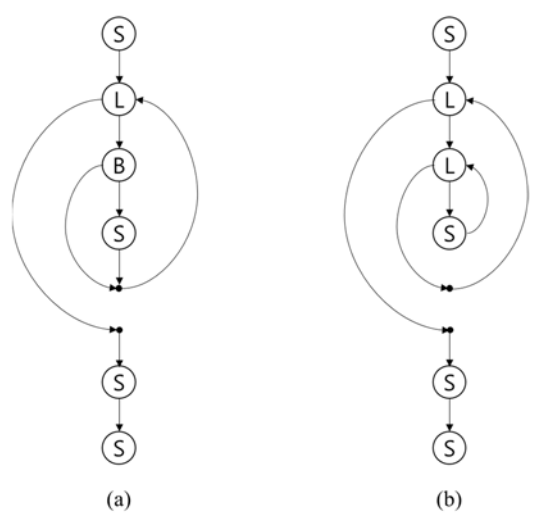

## 문제

Soohwan is leading the International Committee for Program Complexity (ICPC), and the major task of ICPC is measuring the complexity of program codes. A well-known representation of a program is the control flow graph, where the nodes represent the program constructs and the edges the possible flow of controls. The cyclomatic complexity is a popular way to measure the complexity of a flow graph. For the digraph G(V, E) representing a flow graph, the cyclomatic complexity C(G) is defined by the formula C(G) = |E| - |V| + 2. For instance, for the flow graphs G1 and G2 in Figure C.1, the complexities of them are computed to be 3 (C(G1) = C(G2) = 9 - 8 + 2 = 3).

Figure C.1: Two flow graphs G1 (a) and G2 (b)

In Figure C.1, the labels B, L, and S denote the types of nodes: B for a branch, L for a loop, and S for a simple statement. The branch node B introduces additional forward edge skipping one or more statements. The loop node L, the target of an incoming backward edge, also introduces a forward edge exiting the loop. Note that the dots representing the closing points of loops or branches are nodes, too.

One critique for the cyclomatic complexity is that the backward edges introduced by loops are weighted equal to the forward edges. Therefore Soohwan devised a new measure imposing more weights on the backward edges than the forward ones. He classified the edges into two disjoint categories EF for the forward and EB for the backward (E = EF ∪ EB and EF ∩ EB = ∅), and defined a new measure CM, namely the flow graph complexity, using the formula CM(G) = |EF| + W × |EB| - |V| + 2 for a constant weight W for backward edges. Soohwan wants to validate this new measure.

You are to help Soohwan by writing a program calculating the new complexity for a given flow graph. For simplicity, only pretest loops (say, while loops in C) and only one-way branches (say, if statements without else clauses) are assumed. With this assumption, a flow graph can be represented by a string of node types defined as follows:

* L for a loop node,
* B for a branch node, and
* S for a simple statement node.

L and B should be followed by the string representing its sub-structure enclosed by a pair of parentheses. Beware that the closing points are implicitly represented by parentheses. The sequence of node representations are separated by commas. According to this representation, the string representations of the graphs in Figure C.1 are as follows:

* G1: S,L(B(S)),S,S
* G2: S,L(L(S)),S,S

With the weight W = 5, the new complexities for them are CM(G1) = |EF| + W × |EB| - |V| +2 = 8 + 5 × 1 - 8 + 2 = 7 and CM(G2) = |EF| + W × |EB| - |V| + 2 = 7 + 5 × 2 - 8 + 2 = 11.

Write a program to compute CM given the weight W for backward edges and the string representing the flow graph.

## 입력

Your program is to read from standard input. The input starts with a line containing an integer, W (1 < W ≤ 27), where W is the weight for the backward edge. In the following line, the string representation P for the flow graph is given. The length of P is less than 70,000. The string P consists of uppercase alphabets and punctuation symbols. To make the representation easy to read, P may contain spaces; the pairs of brackets [ and ] can be used instead of the pairs of parentheses and they should be matched. P may contain other punctuation symbols such as colon (:), semicolon (;), period (.) erroneously, which your program should detect them as invalid symbols. The input string P is invalid if (1) the parentheses and the brackets are unmatched, (2) it contains punctuation symbols other than parentheses, brackets, and commas, (3) the punctuation symbols are added or omitted wrongly such as S,,S, SS, or B,(S), and (4) it contains unknown types of node other than S, L, or B. A valid graph must contain at least 1 node.

## 출력

Your program is to write to standard output. Print exactly one line for the input. The line should contain the flow graph complexity CM(G) for the given G represented by P. If input string P is invalid, print -1 instead.
