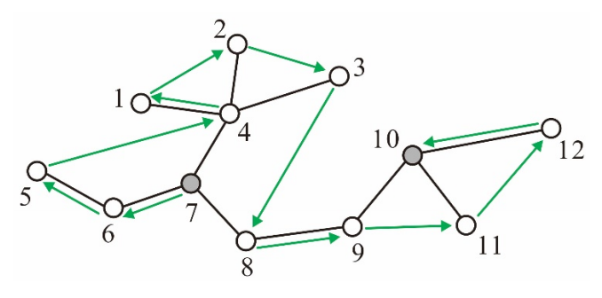

## 문제

A grasshopper is planning to explore a tree, where a *tree* is an undirected graph in which any two vertices are connected by exactly one path. The grasshopper on a vertex of the tree can jump to, and only to, any other vertex within a distance of 3, where the *distance* between two vertices is the number of edges in the path connecting the two. The grasshopper wants to visit every vertex of the tree exactly once, starting at the vertex, s, it is currently on and ending at the vertex, t, it wants.

Given a pair of vertices s and t in a tree with n vertices, your job is to write an efficient program to report an ordering of the vertices of the tree, called a *grasshopper route*, according to which the grasshopper can accomplish what it wants. Specifically, a grasshopper route for s and t in the tree is an ordering 〈u1, u2, …, un 〉of the vertices of the tree such that u1 = s, un = t, and the grasshopper can jump and move from ui to ui+1 for every i ∈ {1, 2, …, n - 1}. Fortunately, it was proven early in 1960 that each pair of vertices of a tree are joined by a grasshopper route.

In the tree shown in Figure D.1 below, for example, there is a grasshopper route 〈7,6,5,4,1,2,3,8,9,11,12,10 〉 for s = 7 and t = 10. The grasshopper can jump from vertex 5 to vertex 4 because the distance between the two is at most 3; however, it cannot jump from vertex 5 to vertex 3. As you guessed, there may exist more than one grasshopper routes.

Figure D.1: A grasshopper route from s to t, where s = 7 and t = 10.

## 입력

Your program is to read from standard input. The first line contains an integer, n, representing the number of vertices of the input tree, where 2 ≤ n ≤ 100,000. It is followed by n - 1 lines, each contains two positive integers u and v that represent an edge between vertex u and vertex v of the input tree. It is assumed that the vertices are indexed from 1 to n. The last line contains two distinct integers s and t, where s, t ∈ {1, …, n}, that respectively represent the start and end vertices of a grasshopper route.

## 출력

Your program is to write to standard output. Print out a required grasshopper route in n lines, containing, one by one, the vertices encountered when we traverse the route from s to t.
