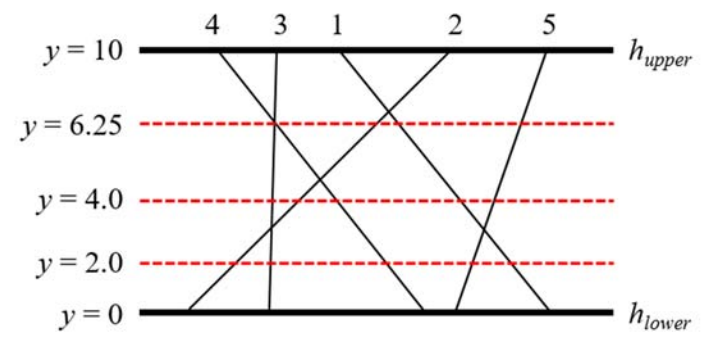

## 문제

There are two distinct horizontal lines hupper and hlower in the xy-coordinate plane and n line segments connecting them. One endpoint of each segment lies on hupper and the other on hlower. All endpoints of the segments are distinct. All segments are numbered from 1 to n. Consider a horizontal line hi located between hupper and hlower, which will be given by a query. The line hi crosses all segments definitely. We want to know which segment intersects at the leftmost with hi. You can observe that the leftmost intersection point between the segments and a query line may lie on one or more segments since two or more segments may intersect at a single point. In that case, the leftmost segment is defined as the segment which has the leftmost endpoint on hupper.

For example, 5 segments and 3 query lines are given in the plane as shown in the figure below. The leftmost segment that intersects with a query line of y = 2.0 is 2 and the leftmost segment that intersects with a query line of y = 4.0 is 3. The query line of y = 6.25 crosses the intersection point between the segments 3 and 4, hence the leftmost segment is 4 by definition.

Given n segments connecting two horizontal lines and m queries, you are to write a program to find the leftmost segment that intersects with each query line.

Note that two or more segments may intersect at a single point. You should be also careful of round-off errors caused by the computer representation of real numbers.

## 입력

Your program is to read from standard input. The input starts with a line containing two integers, maxY and minY (-1,000 ≤ minY < maxY ≤ 1,000), where maxY and minY represent the y-coordinates of the upper horizontal line and the lower horizontal line, respectively. The next line contains an integer n (1 ≤ n ≤ 100,000) which is the number of segments connecting two horizontal lines. All segments are numbered from 1 to n in order given as the input. In the following n lines, each line contains two integers upperX and lowX (-500,000 ≤ upperX, lowX ≤ 500,000) which represent the x-coordinates of the upper endpoint and the lower endpoint of a line segment, respectively. All endpoints are distinct. The next line contains an integer m (1 ≤ m ≤ 100,000) which is the number of queries. In the following m lines, each line contains a y-coordinate given for the query horizontal line, which is a real number between minY and maxY exclusive and the number of digits after the decimal point is 1 or more and 3 or less.

## 출력

Your program is to write to standard output. Print exactly one line for each query in order given as the input. The line should contain the leftmost segment number which intersects with the query horizontal line.
