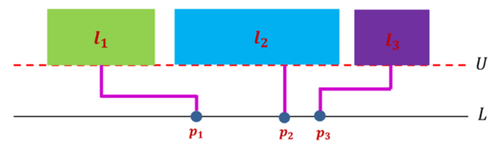
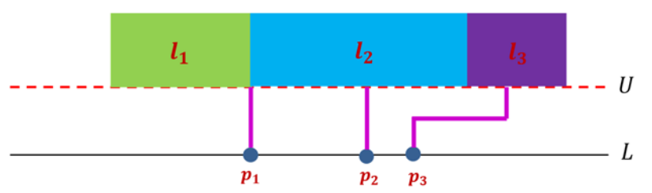

## 문제

Map labeling is to place extra information, usually in the form of textual labels, next to features of interest within a map. The typical features depicted on a map are line features(e.g. roads, rivers, etc.), area features(countries, forests, lakes, etc.), and point features(villages, cities, etc.). In this problem, only the point features will be considered.

The basic requirements on the map labeling are that the labels do not overlap with each other and that they are close to the features they are associated with. However, this is not always possible to be achieved, for example, in the case where the labels are too large or the feature set is too dense. In this problem, the labels may be far from their features such that they are pairwise disjoint. But each feature should be connected to its associated label through a polygonal line including a straight line, called a *connector*. Clearly, the connectors should not intersect with each other. The connectors are only of two kinds. One consists of a single vertical line, called a *straight connector* and the other consists of three connected line segments, that is, vertical, horizontal, and vertical segments, called a *bended connector*. See Figure G.1.

Specifically, there is a straight line L, considered to be the x-axis, on which n points, corresponding to the point features, lie. The locations of the n points are strictly different. In this problem, the labels are considered as rectangular areas with height 1 on the plane. So each point pi is associated with an axis-parallel rectangular label li of width wi and height 1. Note that the heights of all the labels are identical. These rectangular labels should be pairwise disjoint, but the boundaries of two labels can be touched. Consider a line U which is parallel to L, above L, and has a vertical distance 1 from L. The labels li should be placed such that their lower sides are attached on U and they are above U as shown in Figure G.1.

Figure G.1 Rectangular labels of point features

You write a program to find the placements of labels such that the number of bended connectors is minimized. For example, for the point features and the labels given in Figure G.1, the placement of labels shown in Figure G.2 minimizes the number of bended connectors.

Figure G.2 Optimal placement of labels

## 입력

Your program is to read from standard input. The input starts with a line containing an integer, n (1 ≤ n ≤ 10,000), where n is the number of points on the line L, corresponding to the point features. In the ith line of the following n lines, the coordinate ai of the ith point of the n points is given, where ai is an integer and 0 ≤ ai ≤ 108. The coordinates of the n points are strictly different, that is, ai ≠ aj if i ≠ j. In the ith line of the following n lines, the width wi of the associated label of the ith point is given, where wi is an integer and 1 ≤ wi ≤ 105. Note that the heights of all the labels are 1.

## 출력

Your program is to write to standard output. Print exactly one line for the input. The line should contain the minimum number of bended connectors among all the valid placements of labels.
