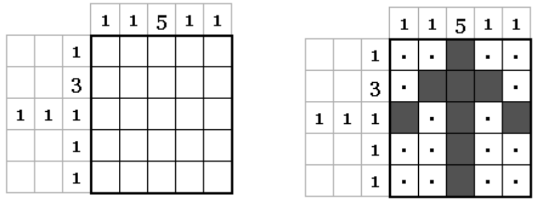

## 문제

A Nonogram is a pencil puzzle played on a grid. The grid is initially blank. There are numbers on the side and top of the grid, which indicate how the grid squares should be filled in. The numbers measure how many unbroken lines of filled-in squares there are in any given row or column. For example, a clue of "4 8 3" would mean there are sets of four, eight, and three filled squares, in that order, with at least one blank square between successive groups. Here is a small example, with its solution.

You are going to work backwards. Given a Nonogram solution, produce the numbers which should be at the side and top of the grid.

## 입력

There will be several test cases in the input. Each test case will begin with an integer n (2≤n≤100) indicating the size of the grid. Each of the next n lines will have exactly n characters, consisting of either '.' for a blank square, or 'X' for a square which has been filled in. The input will end with a line with a single 0.

## 출력

For each test case, print 2n lines of output. The first n lines represent the numbers for the rows, from top to bottom. The next n lines represent the numbers across the top, from left to right. If any row or column has no squares filled in, output a 0. Put a single space between numbers on the same line. Do not output any lines with leading or trailing blanks. Do not output blank lines between any lines of output.
