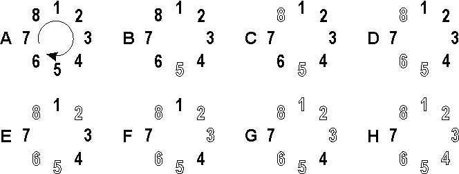

## 문제

"Eenie, meenie, miney, moe... catch a heifer by the toe," an exasperated Bessie muttered. She could never get the syllables right when choosing calves for game playing. Today she is trying to see which of N (1 <= N <= 2,300) heifers conveniently numbered 1..N will get a special hunk of hay made from tender spring grass. Thus, Bessie is leaving it up to you. You will be provided a list of integers. This list is of length L (1 <= L <= 10) and describes a sort of "elimination sequence" containing integers in the range (1..N). If the N heifers are lined up in order in a circle, then the elimination count starts at heifer number 1. The L1th heifer is eliminated. Start at the next heifer, the count proceeds for L2 more heifers to find the baby cow to be eliminated. Both the line of heifers and the elimination sequence are circular, wrapping around as necessary. By way of example, consider a set of 8 heifers and an elimination sequence of {5, 3}. Initially, the 8 heifers form a circle as shown in Figure A.

Starting at heifer 1, count 5 cows and eliminate the 5th one (Figure B). Now count 3 more and eliminate the 3rd cow, which is number 8 (Figure C). The elimination list is exhausted so it is recycled. Count five more heifers and eliminate the fifth one, which is number 6 (Figure D) since number 5 is no longer present. Now count three more to eliminate the third cow, number 2 (Figure E). Recycle the list and count five more to eliminate number 3 (Figure F). Count three more to eliminate number 1 (Figure G), and finally count five more to eliminate number 4 (Figure H). Heifer 7 is left standing.

## 입력

* Line 1: Two space-separated integers: N and L
* Line 2: L space-separated integers (range 1..N) that respectively compose the elimination sequence. Process till EOF.

## 출력

* Line 1: A single integer that is the number of the heifer left standing (who will receive the special hay treat)
