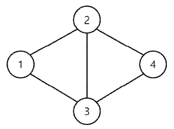

## 문제

철민이는 고양이 한 마리를 키우고 있다. 철민이는 이 고양이를 위해 입체놀이터를 만들었는데 이 놀이터에는 N개의 방들과 M개의 복도들이 있다. 방들은 1번부터 N번까지 번호가 붙어 있고 한 복도는 두 개의 서로 다른 방을 연결하며 양방향으로 이동이 가능하다. 한 쌍의 방을 연결하는 복도는 최대 1개이다. 어떤 두 방도 하나 이상의 복도를 이용하여 서로 이동이 가능하다. 놀이터는 입체로 되어있어 복도가 교차하는 경우는 없다. 아래는 방이 4개, 복도가 5개가 있는 예제이다.

철민이네 고양이는 성격이 매우 산만해서 쉬지 않고 놀이터를 뛰어다닌다. 특히 k(≥ 3)개의 서로 다른 방 (a1,a2,...,ak)의 순서를 정한 다음 그 순서대로 반복적으로 도는 경향이 있다. 즉, a1,a2,...,ak,a1,a2...,ak,a1,a2...의 순서를 말한다. 물론 그렇게 하려면 이 방들이 순서대로 복도로 연결되어 있어야 할 것이다. 즉, a1과 a2가 연결, a2와 a3이 연결,..., ak와 a1이 연결되어 있어야 한다.

철민이는 고양이가 너무 힘들까봐 반복적으로 도는 방법이 없도록 하고 싶다. 노력을 최소화하기 위해 단 한 개의 방만 제거해서 (그리고 그 방에 연결된 복도들은 폐쇄한다) 고양이가 반복적으로 도는 방법이 없도록 만들고 싶다.

앞의 예시처럼 방이 연결되어 있다면 방들 1, 2, 3의 순서로 반복적으로 돌 수가 있다. 또, 방들 1, 2, 4, 3의 순서로도 반복적으로 돌 수 있다. 여기서 2번방을 제거하면 반복적으로 돌 수 있는 방법이 없다. 3번방을 제거해도 같은 결과를 얻는다. 하지만 4번방의 경우에는 제거한다고 하더라도 여전히 반복적으로 돌 수 있는 방법이 있다.

방들의 연결 상태를 입력으로 받아서, 단 하나의 방을 제거하여 고양이가 반복적으로 도는 모든 방법을 없앨 수 있다면 그 방의 번호를 출력한다. 혹시 그러한 방이 여러 개가 있다면 그 방들의 번호의 합을 출력한다. 그러한 방이 없는 경우 0을 출력한다.

## 입력

표준 입력으로 다음 정보가 주어진다. 첫 번째 줄에는 방의 수를 나타내는 정수 N(2 ≤ N ≤ 300,000)과 복도의 수를 나타내는 정수 M(1 ≤M ≤ 300,000)이 주어진다. 다음 M개의 각 줄에는 하나의 복도로 연결된 서로 다른 두 방의 번호가 주어진다. 입력으로 주어진 방들과 복도에서는 반복적으로 도는 방법이 적어도 하나는 있다는 것이 보장된다

## 출력

표준 출력으로, 단 하나의 방을 제거하여 고양이가 반복적으로 도는 모든 방법을 없앨 수 있다면 그 방의 번호를 출력한다. 혹시 그러한 방이 여러 개가 있다면 그 방들의 번호의 합을 출력한다. 그러한 방이 없는 경우 0을 출력한다.

## 힌트

예제 1의 경우에 2번 방을 제거하는 것으로 가능하고, 3번 방을 제거하는 것으로도 가능하다.
