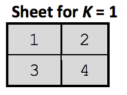
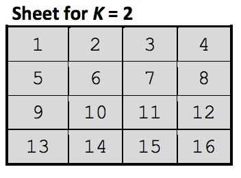

## 문제

You are given a sheet of grid paper of squares with the total size of N × N cells. The number N is a power of 2.

The cells are consecutively numbered from left to right, from top to bottom. In each cell is entered only its number.

The sheet is iteratively folded in half, first - the bottom half over the top half, then the right half over the left half, until the size of the folded sheet becomes equal to 1 × 1.

Obviously, the cells of the folded sheet make up a column with the size of 1 × 1 × N2.

We denote by S = <S1, S2, ..., SP, ... SN2> the string consisting of the numbers in the cells of the obtained column, from the back to front, where P indicates the position of the number in the string.

An IT specialist, who is attending a boring meeting, in order to have fun, is folding the sheet of paper and is building up similar columns to those described above. To occupy his mind, the IT specialist decided to find answers to the following questions:

* Question type 1. You are given a certain number X. What is the P-position of this number in the string S?
* Question type 2. You are given a certain P-position in the string S. What is the number X in this position?

Develop a program to calculate, depending on the type of the question, the number X or the P-position.

## 입력

The standard input contains on the first line the integer Q – the number of questions. Each of the following Q lines of the standard input contain three integers T, K, V, separated by a space:

* T - indicates the type of the question (T = 1 or T = 2);
* K - is the exponent of the power that defines the size of the sheet of paper (N = 2K);
* V - is the number X, if the question is of type 1 (T = 1) or the position P, if the question is of type 2 (T = 2).

## 출력

The standard output shall contain Q lines, one for each of the standard input questions. Each of these lines shall contain a single integer P or X, depending on the type of the question.

## 힌트

S = < 1, 3, 4, 2 >

S = < 1, 13, 16, 4, 8, 12, 9, 5, 6, 10, 11, 7, 3, 15, 14, 2 >
