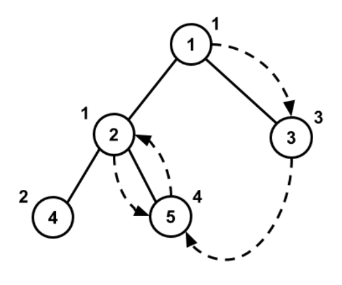

## 문제

In the beautiful country of Moldova there are N cities, indexed from 1 to N, with bidirectional roads connecting some of them. In order to be more economical, the government built exactly N - 1 roads connecting these cities, such that you can go between any two cities by walking through some of the roads.

By a national decree, each of the N cities in Moldova has been assigned a non-negative beauty factor. For city i this beauty factor is equal to ai. Different cities could have equal beauty factors.

Our hero Gigel has arrived to Moldova and he’s currently in city number 1. He’s really eager to visit all the beautiful cities, but he’s quite indecisive and can’t decide which ones to visit, mainly because he has limited time. He will be staying in Moldova for K more days, and on each day he’ll visit some city. On the ith day, he will start from city x in which he ended up the previous day (x = 1 if it’s his first day), and he’ll find another city y ≠ x such that ay - d(x, y) is maximal. Here d(x, y) denotes the minimum number of roads you need to travel starting from city x in order to reach city y. If there are multiple such cities, he’ll choose the one with the minimal index. After this he’ll go to city y and will stay there to admire the local attractions for the remaining time of day i. The next day he’ll repeat this process again.

Gigel is wondering in which city will he end up at the end of the Kth day, and he’s asking for your help!

Write a program that will calculate in which city Gigel will end up after K days.

## 입력

The first line of the standard input contains two integers N and K the number of cities and the number of days Gigel will be visiting. The next line of the standard input will contain N integers ai where ai denotes the beauty of the ith city. The next N - 1 lines of the standard input contain two integers ui and vi, with the meaning that there is a bidirectional road between cities ui and vi.

## 출력

Write in the standard output one integer - the index of the city Gigel will end up at the end of the Kth day.

## 힌트

On the 1st day Gigel will leave city 1 to visit city 3, on the 2nd day he will leave city 3 to visit city 5, on the 3rd day he will leave city 5 to visit city 2 and on the 4th and last day he will leave city 2 to visit city 5 again.

