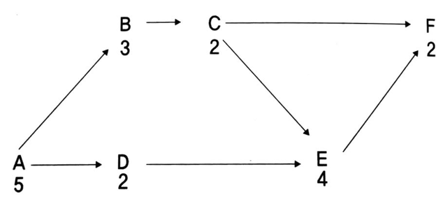

## 문제

퍼트라고 부르는 프로젝트 관리 기법은 큰 프로젝트를 작업 개수로 분할, 각 작업에서 요구되는 시간 계산, 다른 작업이 완료될 때까지 작업이 시작될 수 없도록 하는 결정을 포함한다. 이때 프로젝트를 차트 형식으로 표현할 수 있다.

예를 들어, 입력 예제의 데이터를 사용했을 때 차트는 A, B, C, D, E, F라는 작업을 갖고 각각 5, 3, 2, 2, 4, 2일이 걸리며, C와 D가 완료될 때까지 작업 E는 시작되지 않고, A가 수행되었다면 D와 B는 병렬로 수행 될 수 있다. 퍼트 차트에 따라 프로젝트를 완성하는데 걸리는 최소 시간을 계산하는 프로그램을 작성하시오.

## 입력

입력은 1줄에서 26줄까지 입력될 수 있으며, 각각은 다른 작업 (위 예제에서 말하자면 A, B, C, …) 을 포함한다. 각 줄에는 다음과 같은 내용이 포함된다.

1. 작업 이름을 나타내는 영문 대문자 하나,
2. 작업을 완료하는데 요구되는 날짜를 나타내는 1,000보다 작거나 같은 자연수
3. 0개에서 25개 사이의 덧붙여지는 영문 대문자 (띄어쓰기 없이 붙어 있음)는 이 작업을 시작하기 전에 완료해야만 하는 작업을 나타낸다.

항상 모든 작업을 완료할 수 있는 경우만 입력으로 주어진다.

## 출력

첫째 줄에 모든 작업을 완료하는데 걸리는 시간의 최솟값을 출력한다.
