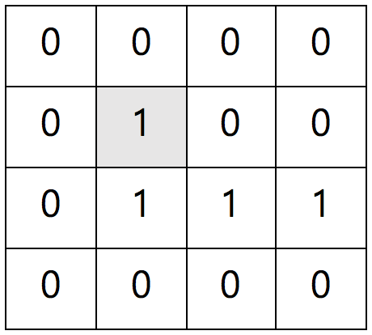
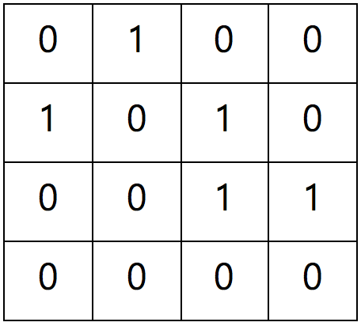
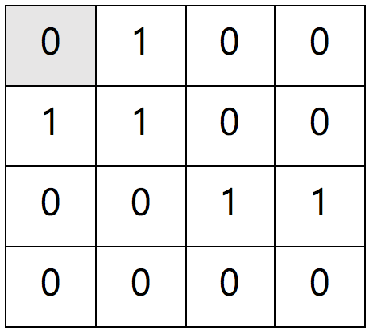
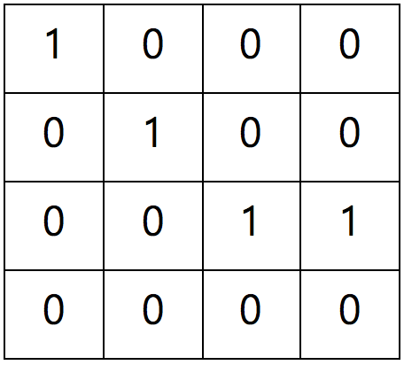

## 문제

홍익이는 N x N 전구 판을 가지고 있다. 전구 판에는 각 칸마다 전구가 하나씩 연결되어 있다. 이 전구 판에서 하나의 전구를 누르면, 해당 전구를 포함하여 상하좌우의 총 5개 전구들의 상태가 변화한다. 다시 말해, 5개의 전구들 중 불이 켜져 있던 전구는 불이 꺼지고, 불이 꺼져 있던 전구는 불이 켜진다.

예를 들어, <그림1> 같은 전구 판이 있다고 하자. 0은 전구가 꺼져 있는 것을 의미하고, 1은 전구가 켜져 있는 것을 의미한다.



<그림 1>

<그림 1>에서 (2, 2) 전구(회색 부분)를 눌러보면, <그림 2>와 같이 전구 판이 변화한다.



<그림 2>

또 다른 예로 <그림 3>에서 (1,1)의 전구를 눌러보면,



<그림3>

<그림4>와 같이 전구판의 모습이 변화한다.



<그림4>

※ (1, 1)에서 위와 왼쪽에는 전구가 없다. 따라서 밑, 오른쪽, 그리고 자신의 전구 상태만 바뀐다.

홍익이는 현재 전구 판의 상태를 보고 최대한 적은 횟수로 전구들을 눌러 전구판의 모든 전구를 끄고 싶다.

홍익이를 도와서 전구 판의 모든 전구를 끌 수 있는 최소 횟수 B를 알아보자.

만약, 전구를 끌 수 있는 방법이 없다면, -1을 출력하도록 한다.

## 입력

```

N
0과 1로 이루어진 NxN 행렬
```

* 2 <= N <= 18

## 출력

```

B
```

## 힌트

예제 1: (모든 전구를 다 눌러야한다.)

예제 2: (0,1), (0,2), (1,0), (2,0), (2,2)를 누르면 된다.
