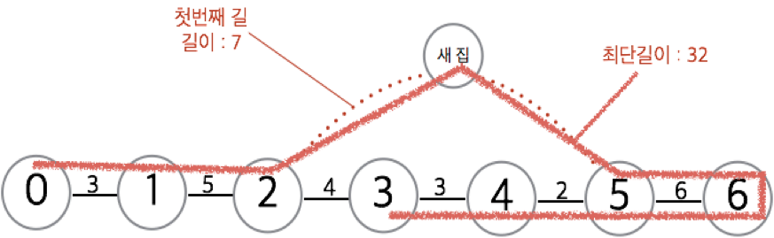
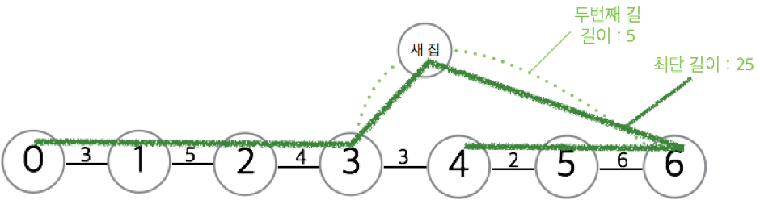

## 문제

> 띵동~  
> “누구세요?”  
> “치킨배달 왔습니다.”  
> “음? 치킨을 시킨 적이 없… 으아악!”

손님이 주문하지도 않은 치킨을 배달해 주는 인호는 굿-점원이다. 인호는 아래 그림과 같이 일자로 난 길을 따라 손님들에게 차례로 치킨을 선물해주고 있다.

어느 날 치킨을 배달해야 할 집이 하나 늘었다. 인호는 새로운 손님에게 치킨을 배달하기 위해 길을 딱 하나만 만들려고 한다. 인호의 친구들은 각자 자기가 만들 수 있는 길을 알려주었다.

인호는 치킨가게를 0번 집, 그리고 가게와 가까운 집부터 차례대로 1번 집부터 n번 집이라고 부른다.

인호는 0번 집(가게)에서 시작해 1번부터 N번까지 모든 집과 새로운 집을 방문해야 한다.

인호는 길을 따라 걸으며 새로 만드는 길과 연결된 집에서만 방향을 바꿀 수 있다. 그리고 막다른 길에 다다르면 되돌아간다.

인호는 배달을 마친 후 친구가 만들어 준 길을 다 걷지 않았다면 마저 걸어야 한다.

인호가 가장 조금 걷고 치킨배달을 마칠 수 있는 거리를 구해 보자.

## 입력

첫 번째 줄에는 인호가 원래 배달하던 집 수 n과 길을 만들어 주는 친구의 수 m이 나온다.

두 번째 줄에는 i-1번 집에서 i번 집까지의 거리 Li가 차례로 나온다. (i = 1, 2, 3, …, n)

세 번째 줄부터 m개의 줄에 걸쳐서 j번째 친구가 만들 수 있는 길의 정보 Aj Bj Cj가 나온다. j번째 길은 Aj번째 집과 Bj번째 집과 연결되어 있으며, 길이는 Cj이다. A와 B는 항상 다르다. (j = 1, 2, 3, …, m)

(1 ≤ n,m ≤ 10000, 1 ≤ L ≤ 100, 1 ≤ A,B ≤ n, 1 ≤ C ≤ 100)

## 출력

새로운 길을 만든 뒤, 인호가 모든 집에 치킨을 배달하기 위해 걸어야 하는 거리 중 최솟값을 출력한다.

## 힌트

두 번째 길을 이용해0-1-2-3-새집-6-5-4 순서로 이동하면 25의 거리를 이동해 가장 조금만 걷고 배달을 마칠 수 있다.
