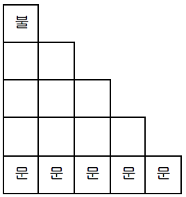

## 문제

기웅이와 민수는 랩실의 한 구석에서 불장난을 하는 걸 좋아한다. 어느 날 두 사람이 불장난을 하던 중 랩실에 불이 났다!

랩실의 바닥은 길이가 1인 정사각형 모양의 타일들로 이루어져 있고, 랩실은 아래 그림과 같은 직각삼각형 모양이다. 두 사람은 랩실 한쪽 가장 구석의 타일에서 불장난을 하고 있었다.

랩실 구석 타일 위에 붙은 불은 매 초마다 가로, 세로 그리고 대각선 방향으로 한 타일씩 번진다. 기웅이와 민수는 불이 타오르기 딱 1초 전에 불이 붙은 타일에서 도망가기 시작했다. 기웅이와 민수는 1초에 아래 방향, 또는 오른쪽 아래 대각선으로만 한 칸을 움직일 수 있다. 처음 불장난을 하던 타일을 제외하고 두 사람이 같은 타일 위에 선다면 두 사람은 부딪혀서 넘어지게 된다. 그리고 뜨거운 맛을 보게 될 것이다.

불장난을 하던 구석과 접한 벽에는 문이 없고, 맞은편 벽에 도착하면 문을 통해 랩실 밖으로 나갈 수 있다. 두 사람이 모두 안전하게 방을 탈출하는 경우의 수를 구해보자

## 입력

방의 한 모서리의 길이 n이 나온다. (1 < n ≤ 100)

## 출력

두 사람이 안전하게 방을 빠져나오는 경우의 수를 10,007로 나눈 나머지를 출력한다.

## 힌트

랩실의 크기가 3일 경우 (기웅, 민수)가 이동 가능한 방법은 (아래-아래, 대각-아래), (아래-아래, 대각-대각), (아래-대각, 대각-대각), (대각-아래, 아래-아래), (대각-대각, 아래-아래), (대각-대각, 아래-대각) 이 있다.
