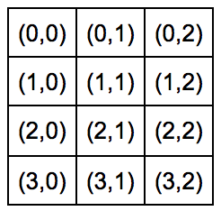
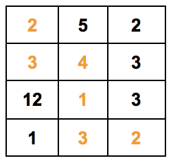
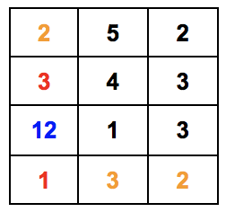

## 문제

기윤이는 군대 탈출 게임을 좋아한다. 이 게임을 완료하기 위해서는 병영을 통과해 탈출해야 한다. 병영의 모습은 군기를 위해 항상 n x m 직사각형 모양이다.

블록(0,0)에서 출발하여 병영 밖으로 나가지 않고 상, 하, 좌, 우 4방향으로만 이동하여 블록(n-1,m-1)에 도착해야 병영을 탈출 한 것 이다. 즉, 반드시 블록(0,0)과 블록(n-1,m-1)을 밟아야 한다.

각 블록은 레벨 제한이 있다. 만약 블록의 숫자가 3이라면 최소한 레벨 3이 되어야 그 블록을 지나갈 수 있다는 뜻이다.

**4x3** **병영** **타일** **번호**

****

**타일** **레벨** **제한**

위와 같은 병영이 주어졌을 때 병영을 탈출 하기 위해 필요한 레벨은 4이다.

(2-3-4-1-3-2 : 최댓값 4)

그러나 기윤이는 공군의 특수장비를 사용하여 단 한번 타일을 무시하고 건너뛰어 다음 타일로 갈 수 있다.

특수장비의 조건은 다음과 같다.

1. 타일을 뛰어넘는 도중에 방향을 바꿀 수 없다.
2. 병영 밖으로는 넘어갈 수 없다.

그러므로, 기윤이가 특수장비를 사용한 경우, 위의 예시에서 필요한 레벨의 최소 값은 3이다.

(2-3-(12)-1-3-2 : 최댓값 3)

기윤이가 병영을 탈출하기 위해 달성해야 하는 최소한의 레벨을 알려주자!

## 입력

첫 줄에 각 병영의 세로 길이 n, 가로 길이 m 이 주어진다. (1 ≤ n, m ≤ 100)

다음 줄부터 차례대로 병영의 블록별 레벨 제한 k가 주어진다. (0 ≤ k ≤ 109).

## 출력

기윤이가 병영을 탈출하기 위해 달성해야 하는 최소한의 레벨을 출력한다.
