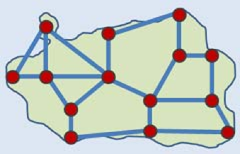
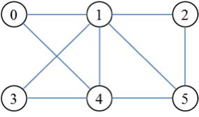

## 문제

The ICPC-World is the most popular RPG game for ACM-ICPC contestants, whose objective is to conquer the world. A map of the game consists of several cities. There is at most one road between a pair of cities. Every road is bidirectional. If there is a road connecting two cities, they are called neighbors. Each city has one or more neighbors and all cities are connected by one or more roads. A player of the game can start at any city of the world. After conquering a city that the player stays, the player can proceed to any neighbor city which is the city the player to conquer at the next stage.

Chansu, a mania of the game, enjoys the game in a variety of ways. He always determines a list of cities which he wants to conquer before he starts to play the game. In this time, he wants to choose as many cities as possible under the following conditions: Let (c0, c1, …, c*m*-1)be a list of cities that he will conquer in order. All cities of the list are distinct, i.e., c*i* ≠ c*j* if *i* ≠ *j*, c*i* and c*i*+1 are neighbors to each other, and the number of neighbors of c*i*+1 is greater than the number of neighbors of c*i* for *i* = 0, 1, …, *m*-2.

For example, let’s consider a map of the game shown in the figure below. There are six cities on the map. The city 0 has two neighbors and the city 1 has five neighbors. The longest list of cities satisfying the above conditions is (2,5,4,1) with 4 cities.

In order to help Chansu, given a map of the game with *n* cities, write a program to find the maximum number of cities that he can conquer, that is, the length of the longest list of cities satisfying the above conditions.

## 입력

Your program is to read from standard input. The input starts with a line containing two integers, *n* and *m* (1 ≤ *n* ≤ 100,000, *n*-1 ≤ *m* ≤ 300,000), where *n* is the number of cities on the game map and *m* is the number of roads. All cities are numbered from 0 to *n*-1. In the following *m* lines, each line contains two integers *i* and j (0 ≤ *i* ≠ *j* ≤ *n*-1) which represent a road connecting two cities *i* and *j*.

## 출력

Your program is to write to standard output. Print exactly one line. The line should contain the maximum number of cities which Chansu can conquer.
