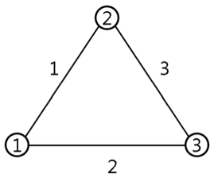

## 문제

Let *G* be a connected simple undirected graph where each edge has an associated weight. Let’s consider the popular MST (Minimum Spanning Tree) problem. Today, we will see, for each edge *e*, how much modification on *G* is needed to make *e* part of an MST for *G*. For an edge *e* in *G*, there may already exist an MST for *G* that includes *e*. In that case, we say that *e* is *happy* in *G* and we define *H*(*e*) to be 0. However, it may happen that there is no MST for *G* that includes *e*. In such a case, we say that *e* is *unhappy* in *G*. We may remove a few of the edges in *G* to make a *connected* graph *G*′ in which *e* is happy. We define *H*(*e*) to be the minimum number of edges to remove from *G* such that *e* is happy in the resulting graph *G*′.

Figure E.1. A complete graph with 3 nodes.

Consider the graph in Figure E.1. There are 3 nodes and 3 edges connecting the nodes. One can easily see that the MST for this graph includes the 2 edges with weights 1 and 2, so the 2 edges are happy in the graph. How to make the edge with weight 3 happy? It is obvious that one can remove any one of the two happy edges to achieve that.

Given a connected simple undirected graph *G*, your task is to compute *H*(*e*) for each edge *e* in *G* and print the total sum.

## 입력

Your program is to read from standard input. The first line contains two positive integers *n* and *m*, respectively, representing the numbers of vertices and edges of the input graph, where *n* ≤ 100 and *m* ≤ 500. It is assumed that the graph *G* has *n* vertices that are indexed from 1 to *n*. It is followed by *m* lines, each contains 3 positive integers *u*, *v*, and *w* that represent an edge of the input graph between vertex *u* and vertex *v* with weight *w*. The weights are given as integers between 1 and 500, inclusive.

## 출력

Your program is to write to standard output. The only line should contain an integer *S*, which is the sum of *H*(*e*) where *e* ranges over all edges in *G*.
