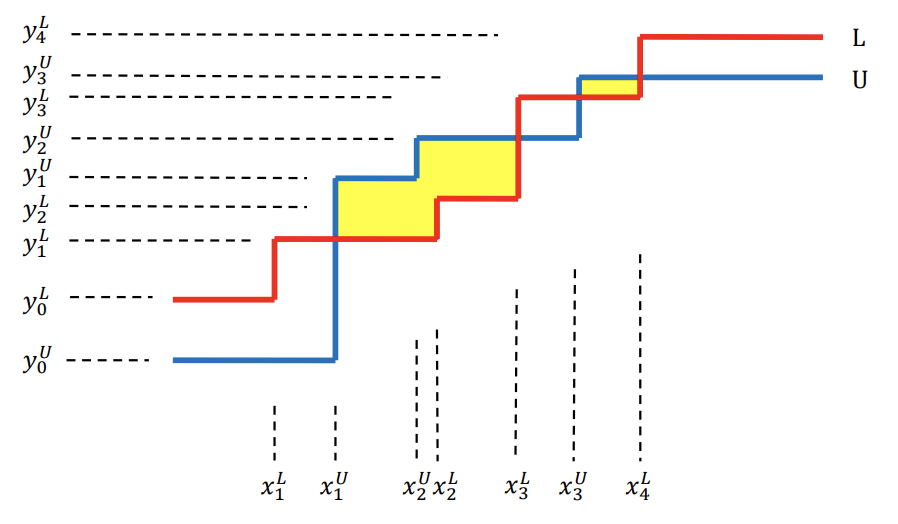

## 문제

A rectilinear path connecting two points in the plane is a path consisting of only horizontal and vertical line segments. A rectilinear path is said to be *monotone* with respect to the *x*-axis (resp., *y*-axis) if and only if its intersection with every vertical (resp., horizontal) line is either empty or a contiguous portion of that line. A *staircase* is a rectilinear path if it is monotone to both the *x*-axis and the *y*-axis, and a staircase is *unbounded* if it starts and ends with a semi-infinite horizontal segment, i.e., a segment that extends to infinity on both ends of the *x*-axis. Note that staircases can be either increasing or decreasing, depending on whether they go up or down as we move along them from left to right on the *y*-axis. A staircase with *n* vertical line segments is called a staircase with *n* steps.

Considering two unbounded staircases L and U, there can be several or no *closed* *rectilinear* *regions* bounded by staircases L and U. Among the closed rectilinear regions, some regions are bounded by a staircase L to the bottom and by a staircase U to the top. For example, in the following figure, the two regions colored yellow are that kind of closed rectilinear regions. We would like to compute the total area of such regions.

**Figure** **G.1.** Two staircases L and U, where U has 3-steps and L has 4-steps. The two yellow colored regions are closed rectilinear regions bounded by a staircase L to the bottom, and a staircase U to the top. The *xiL*,*yiL* (resp., *xiU*,*yiU*) are the *x*-, *y*-coordinates of corner points of the staircase L (resp., U).

*y*0 *x*1 *y*1 *x*2 *y*2 … *xn* *yn*  --------------------------------      (1)

where *x*1 < *x*2 < … < *xn* for *x*-coordinates of vertical line segments, and *y*0 < *y*1 < … < *yn* for *y*-coordinates of horizontal line segments of an increasing staircase or *y*0 > *y*1 > … > *yn* for a decreasing staircase.

For example, given a 4-step staircase L represented with

> 6 2 9 11 11 15 16 21 19

and a 3-step staircase U represented with

> 3 6 12 10 14 18 17

the number of bounded rectilinear regions is 2 and the total area of the regions is 32 (see figure G.1).

Given two unbounded staircases L and U that *all* *x-coordinates* *represented* *in* *(1)* *of* *corner* *points* *of* *both* *L* *and* *U* *are* *unique,* *and* *all* *y-coordinates* *represented* *in* *(1)* *of* *corner* *points* *of* *both* *L* *and* *U* *are* *unique*, compute the total area of bounded rectilinear regions that bounded by L to the bottom of the regions and by U to the top of the regions.

## 입력

Your program is to read from standard input. The first line contains two positive integers *n* and *m*, respectively, representing the number of steps of unbounded staircases L and U, where 1 ≤ *n*,*m* ≤ 25,000    25,000. The second (resp., third) line contains 2*n* + 1 (resp., 2*m* + 1) integers representing the *x*-, *y*-coordinates of corner points of the staircase L (resp., U), and the integers are sequenced in the order of the notation (1). The coordinates are represented with non-negative integers less than or equal to 50,000.

## 출력

Your program is to write to standard output. The first line should contain two integers *k* and *w*, where *k*represents the number of closed rectilinear regions and *w* represents the total area of those regions. If there is no such regions, then your program should write 0 for both *k* and *w*.
