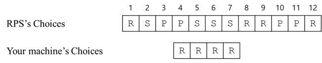

## 문제

There is a Rock Paper Scissors (RPS) machine which generates Rock, Paper, or Scissors randomly. You also have a similar small Rock Paper Scissors machine. Before the game, the RPS machine will generate a list of its choice of Rock, Paper, or Scissors of the length *n* and your machine also will generates a list of its choice of the length *m*. That is, you know the whole list of the RPS’s choices and you have the list of your machine’s choices. Of course, each choice of the machines is one of the three options (Rock, Paper, or Scissors).

Now, you start playing Rock Paper Scissors game. In every match, you compare the list of RPS’s choice and the list of your machine’s in sequence and decide whose machine would win. However, only you may skip some RPS’s choices to find the position to get the most winning points of your machine. After you decide to start match you cannot skip the match till the end of the match. ‘`R`’ stands for Rock, ‘`P`’ stands for Paper, and ‘`S`’ stands for Scissors.

For example, suppose that the RPS’s list is “`RSPPSSSRRPPR`” and your machine’s list is “`RRRR`”. To get the most winning points, you should start the match after skipping three RPS’s choices or four RPS’s choices. (See Figure H.1.) Then, you can win in three matches. The draw case is not considered.

Figure H.1. The most winning position against RPS machine when *n* = 12 and *m* = 4.

Given the list of RPS’s choices and the list of your choices, find the position to get the maximum number of wining matches.

## 입력

Your program is to read from standard input. The first line contains two positive integers *n* and *m* (1 ≤ *m* < *n* ≤ 100,000), where *n* is the length of the string for RPS machine and *m* is the length of the string for your machine. Following the first line contains the list of choices of RPS machine and the second line contains the list of choices of your machine.

## 출력

Your program is to write to standard output. The first line should contain an integer indicating the maximum number of wining matches
