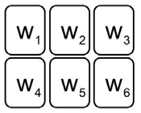

## 문제

Slot machines are popular game machines in casinos. The slot machine we are considering has six places where a figure appears. By combination of figures, one may earn or lose money. There are ten kinds of figures, so we will represent a figure with a number between 0 and 9. Then we can use a six-digit number *w* = *w*1*w*2*w*3*w*4*w*5*w*6 where 0 ≤ *w*1, *w*2, *w*3, *w*4, *w*5, *w*6 ≤ 9 to represent one possible outcome of the slot machine.

Figure I.1. The layout of a slot machine.

Old slot machines were made up with mechanical components, but nowadays they were replaced by PC-based systems. This change made one critical flaw: they are based on pseudo-random number generators and the outcome sequences of a slot machine are periodic. Let *T*[*i*] be the *i*-th outcome of a slot machine. At first, there is a truly random sequence of length *k*,*T*[*1*],*T*[*2*],…,*T*[*k*]. Then there exists one positive number such that *T*[*i*+*p*] = *T*[*i*]for all possible values of *i*(>*k*). Once an attacker can find out the exact values of *k* and *p*, he or she can exploit this fact to beat the casino by betting a lot of money when he or she knows the outcome with a good combination in advance.

For example, you have first six numbers of outcome sequences: 612534, 3157, 423, 3157, 423, and 3157. Note that we can remove first 0’s. Therefore, 3157 represents 003157 and 423 represents 000423. You want to know its tenth number. If you know the exact values of *k* and *p*, then you can predict the tenth number. However, there are many candidates for *k* and *p*: one extreme case is *k*=5 and *p*=1, and another is *k*=0 and *p*=6. The most probable candidate is the one where both *k* and *p* are small. So, our choice is the one with the smallest *k*+*p*. If there are two or more such pairs, we pick the one where *p* is the smallest. With our example, after some tedious computation, we get *k*=1 and *p*=2.

Assume that you have *n* consecutive outcomes of a slot machine, *T*[1], *T*[2], …, *T*[*n*]. Write a program to compute the values of *k* and *p* satisfying the above-mentioned condition.

## 입력

Your program is to read from standard input. The first line contains a positive integer *n* (1 ≤ *n* ≤ 1,000,000), representing the length of numbers we have observed up to now in the outcome sequence. The following line contains *n* numbers. Each of these numbers is between zero and 999,999.

## 출력

Your program is to write to standard output. Print two integers *k* and *p* in one line.
