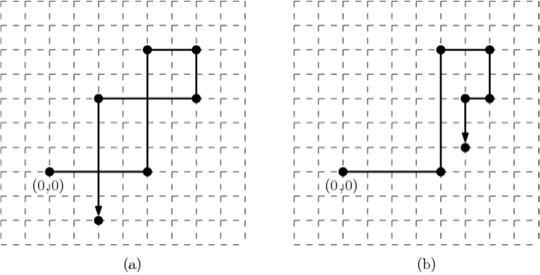

## 문제

A rectilinear chain is an ordered sequence that alternates horizontal and vertical segments as in Figure K.1. You are given a rectilinear chain whose first segment starts from the origin (0,0) and goes to the right. Such a rectilinear chain of *n* edges can be described as a sequence of *n* pairs (*lk*,*tk*) where *lk* is the length of the *k*-th edge *ek* and *tk* denotes the turning direction from the *k*-th edge *ek* to the (*k*+1)-st edge *ek*+1. For 1 ≤ *k* < *n*, if the chain turns left from *ek* to *ek*+1, then *tk* = 1, and if it turns right, then *tk* = -1. For *k* = *n*, *tk* is set to be zero to indicate that *ek* is the last edge of the chain. For example, a rectilinear chain of six pairs shown in Figure 1(a) is described as a sequence of six pairs (4, 1), (5, -1), (2, -1), (2, -1), (4, 1), (5, 0).

Figure K.1. (a) A non-simple chain. (b) An untangled simple chain

You would already notice that the rectilinear chain drawn by the given description is not simple. A chain is *simple* if any two edges in the chain have no intersection except at the end points shared by adjacent edges. To represent the chain in a more succinct way, you want to make it simple if it is not simple. In other words, you need to untangle a given rectilinear chain to a simple chain by modifying the length of its edges. But the length of each edge in the resulting chain must be at least 1 and at most *n*, and the turning directions must be kept unchanged. The chain shown in Figure K.1(b) shows one of possible modifications for the non-simple chain given in Figure K.1(a), and its description is (4, 1), (5, -1), (2, -1), (2, -1), (1, 1), (2, 0).

Given a description of a rectilinear chain, you should write a program to untangle the rectilinear chain.

## 입력

Your program is to read from standard input. The first line contains an integer, *n* (1 ≤ *n* ≤ 10,000), representing the number of edges of an input rectilinear chain. In the following *n* lines, the *k*-th line contains two integers *lk* and *tk* for the edge *ek*, separated by a single space, where *lk* (1 ≤ *lk* ≤ 10,000) is the length of *ek*, and *tk* is the turning direction from *ek* to *ek*+1; *tk* =  1 if it is the left turn and *tk* = -1 if it is the right turn for 1 ≤ *k* < *n*, and *tk* = 0 for *k* = *n*.

## 출력

Your program is to write to standard output. The first line should contain *n* positive integers, representing the length of the edges of your untangled simple chain according to the edge order of the input chain. Each length should be at least 1 and at most *n*. Note that you do not need to output the turning directions because the turning directions of the simple chain is identical to the ones of the input chain. You can assume that any rectilinear chain described in the input can be untangled with the edge length condition.
