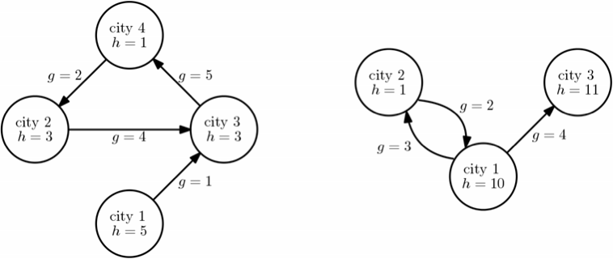

## 문제

A group of people plan to have a vacation in a remote island near the equator over the winter holiday. All members of the group live in different countries and the destination island is only reachable via airplane. Therefore, each member has to go to their own country’s airport to take a flight to the destination island. We assume that each country has only one airport. Now, for the sake of holiday spirit, all group members agree to start the journey on the same day from their home cities. Also, they plan to be at their country’s airports on the same day, which is not necessarily the first day of their travel. However, the airports might not be in each member’s home city, so some members may have to travel to another city over the course of a few days. On the first day of the winter holiday, all members are in their respective home cities. Then, every day, each member has to individually decide between traveling to an adjacent city (meaning that the two cities are connected by a road), or staying the day in the city they are currently in. Since the travelling cost between two adjacent cities and the cheapest hotel price in each city are already known to the world, one knows exactly how much it will cost either to move to an adjacent city or to stay in that city for each day. All members want to have as much money as possible for the vacation on the island, so they pool their money together and decide to calculate the travel plans as a group. Their goal is that all the members end up at their designated countries’ airports on the same day, while spending the least amount of money.

Figure L.1. Two members’ country layouts, where the designated airports are in cities 4 and 3, respectively. The home city is 1 for both. ***g*** denotes the travelling cost between two cites and ***h*** denotes the cheapest hotel price.

Consider an example in Figure L.1 with two members and their designated airports being in cities 4 and 3, respectively. The cheapest travel plans with both members starting in their hometowns (always city 1) would be: (day 1) member-1 moves to city 3, member-2 moves to city 2; (day 2) member-1 moves to city 4, member-2 moves to city 1; (day 3) member-1 stays at city 4, member-2 moves to city 3. This has cost (1 + 5 + 1) + (3 + 2 + 4) = 16.

Note that the travelling cost between two cites is not necessary symmetric. Additionally, no city has a road connecting it to itself. You can always assume that, in each country, there is at least one path from home to the designated airport.

You should write a program that finds the minimum cost required to get all members from their home city to their country’s designated airport such that everyone is at the airport on the same day. Note that every day, one has to either move to an adjacent city or stays at the current city hotel.

## 입력

Your program is to read from standard input. The first line contains a single integer 1 ≤ *p* ≤ 3 denoting the number of people in the group that will be going on vacation (and therefore also the number of countries to be considered). Then the next input represents each country as follows: The next line consist of two integers 1 ≤ *n* ≤ 50 and *n* – 1 ≤ *m* ≤ 4 × *n*, corresponding to the number of cities and roads in the country. The next *n* lines contain exactly one integer, 0 ≤ *h* ≤ 1,000,000, representing the cheapest hotel cost of each city (the costs are given in order from city 1 to *n* for each country). The next   lines contain the road information. Each road is represented by three integers, separated by spaces: 1 ≤ *u*, *v* ≤ *n* and 0 ≤ *g* ≤ 1,000,000, which are the cities at the start and the end of the road, respectively, and the cost to travel on the road from *u* to *v*. Finally, one more line is given containing a single integer 1 ≤ *a* ≤ *n*, denoting the city containing that country’s airport. In each country, city 1 is each one’s home city.

## 출력

Your program is to write to standard output. You should output exactly one line containing a single integer equal to the minimum cost required to get all members from their home city to their country’s designated airport such that everyone is at the airport on the same day.
