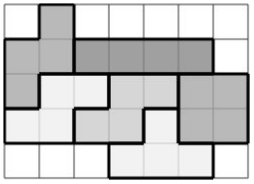

## 문제

Ivica is a passionate computer scientist. He recently started working on his first computer game: a clone of the popular Tetris. Although he’s far from being finished, his program supports placing five different Tetris figures shown in the image below in a matrix. Before placing it in the Tetris matrix, the figure can be rotated by 90 degrees an arbitrary number of times and coloured. Additionally, the current version of the game doesn’t support placing the figure if that would mean it goes out of the matrix boundaries or overlaps with another existing figure in the matrix.

|  |  |  |  |  |
| --- | --- | --- | --- | --- |
|  |  |  |  |  |
| Figure 1 | Figure 2 | Figure 3 | Figure 4 | Figure 5 |

While Ivica was in school, his sister Marica started the game and randomly rotated, coloured and placed the figures in a way that the adjacent figures are coloured differently. Two figures are adjacent if they share a common side or touch in the tip.

When Ivica came back to his computer, he found the game running with the figures his sister placed. He wants to know how many of which figures there are in the Tetris matrix and he is asking you to help him solve this problem while he’s busy with improving the game.

## 입력

The first line of input contains positive integers N and M (1 ≤ N, M ≤ 10) that represent the number of rows and columns of the Tetris matrix. Each of the following N lines contains M characters that represent the matrix.

Each character can be ‘.’ (dot) that represents a blank space or a lowercase letter of the English alphabet that represents a part of the figure. Different letters represent different colours, and the parts of the same figure are coloured the same.

## 출력

You must output exactly five rows. The i th line must contain the number of appearances of the i th figure in the game of Tetris.

## 힌트

Clarification​ ​of​ ​the​ ​third​ ​test​ ​case:

The following image depicts the Tetris matrix when Ivica came back to his computer.

