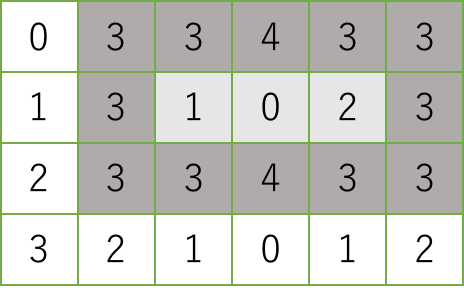
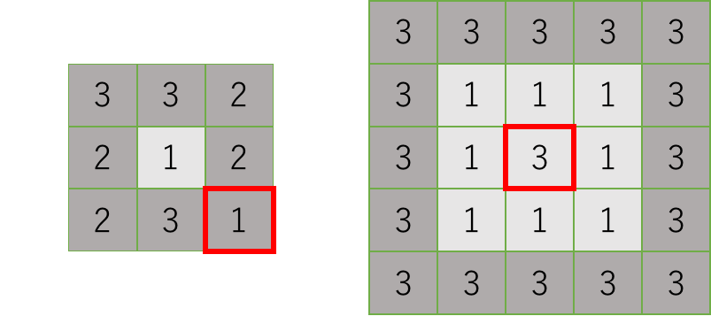

## 문제

Mr. Gardiner is a modern garden designer who is excellent at utilizing the terrain features. His design method is unique: he first decides the location of ponds and design them with the terrain features intact.

According to his unique design procedure, all of his ponds are rectangular with simple aspect ratios. First, Mr. Gardiner draws a regular grid on the map of the garden site so that the land is divided into cells of unit square, and annotates every cell with its elevation. In his design method, a pond occupies a rectangular area consisting of a number of cells. Each of its outermost cells has to be higher than all of its inner cells. For instance, in the following grid map, in which numbers are elevations of cells, a pond can occupy the shaded area, where the outermost cells are shaded darker and the inner cells are shaded lighter. You can easily see that the elevations of the outermost cells are at least three and those of the inner ones are at most two.



A rectangular area on which a pond is built must have at least one inner cell. Therefore, both its width and depth are at least three.

When you pour water at an inner cell of a pond, the water can be kept in the pond until its level reaches that of the lowest outermost cells. If you continue pouring, the water inevitably spills over. Mr. Gardiner considers the larger *capacity* the pond has, the better it is. Here, the capacity of a pond is the maximum amount of water it can keep. For instance, when a pond is built on the shaded area in the above map, its capacity is (3 − 1) + (3 − 0) + (3 − 2) = 6, where 3 is the lowest elevation of the outermost cells and 1, 0, 2 are the elevations of the inner cells. Your mission is to write a computer program that, given a grid map describing the elevation of each unit square cell, calculates the largest possible capacity of a pond built in the site.

Note that neither of the following rectangular areas can be a pond. In the left one, the cell at the bottom right corner is not higher than the inner cell. In the right one, the central cell is as high as the outermost cells.



## 입력

The input consists of at most 100 datasets, each in the following format.

```

d w 
e1, 1 ... e1, w 
... 
ed, 1 ... ed, w 
```

The first line contains *d* and *w*, representing the depth and the width, respectively, of the garden site described in the map. They are positive integers between 3 and 10, inclusive. Each of the following *d* lines contains *w* integers between 0 and 9, inclusive, separated by a space. The *x*-th integer in the *y*-th line of the *d* lines is the elevation of the unit square cell with coordinates (*x, y*).

The end of the input is indicated by a line containing two zeros separated by a space.

## 출력

For each dataset, output a single line containing the largest possible capacity of a pond that can be built in the garden site described in the dataset. If no ponds can be built, output a single line containing a zero.
