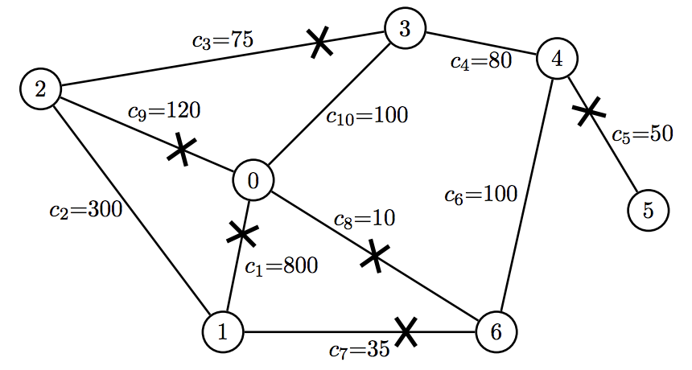

## 문제

The BAPC draws a large number of visitors to Amsterdam. Many of these people arrive at the train station, then walk from intersection to intersection through the streets of Amsterdam in a big parade until they reach the BAPC location.

A street can only allow a certain number of people per hour to pass through. This is called the capacity of the street. The number of people going through a street must never exceed its capacity, otherwise accidents will happen. People may walk through a street in either direction.

The BAPC organizers want to prepare a single path from train station to BAPC location. They choose the path with maximum capacity, where the capacity of a path is defined to be the minimum capacity of any street on the path. To make sure that nobody walks the wrong way, the organizers close down the streets which are incident1 to an intersection on the path, but not part of the path.

Can you write a program to help the organizers decide which streets to block? Given a graph of the streets and intersections of Amsterdam, produce the list of streets that need to be closed down in order to create a single maximum-capacity path from the train station to the BAPC. The path must be simple, i.e. it may not visit any intersection more than once.

1An edge is incident to a vertex if the vertex is an endpoint of the edge.

## 입력

* The first line contains two integers: n, the number of intersections in the city, and m, the number of streets (1 ≤ n, m ≤ 1000).
* The following m lines each specify a single street. A street is specified by three integers, ai, bi and ci, where ai and bi are ids of the two intersections that are connected by this street (0 ≤ ai, bi < n) and ci is the capacity of this street (1 ≤ ci ≤ 500000). Streets are numbered from 0 to m − 1 in the given order.

You may assume the following:

* All visitors start walking at the train station which is the intersection with id 0. The BAPC is located at the intersection with id n − 1.
* The intersections and streets form a connected graph.
* No two streets connect the same pair of intersections.
* No street leads back to the same intersection on both ends. • There is a unique simple path of maximum capacity.

## 출력

Output a single line containing a list of space separated street numbers that need to be blocked in order to create a single maximum-capacity path from train station to BAPC. Sort these street numbers in increasing order.

If no street must be blocked, output the word “none” instead.

## 힌트

Figure 2: Illustration of the first example input.
