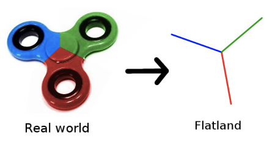
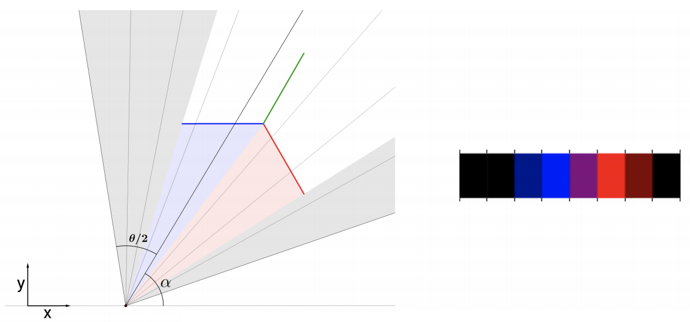

## 문제

Freddy the Flatland Photographer wants to report on fun new things in Flatland for the Flatland Financial Times. He saw a really nice picture of a Fidget Spinner in Flatland Weekly, and he would like to publish a similar picture. Actually, he likes the picture so much he would like to use the exact same picture. Flatland copyright law forbits Freddy from copying the picture, so he decides to take an originalTM picture that looks the same. Can you help Freddy position his camera?

A fidget spinner

**On Flatland Photography**

Freddy has one really fancy 1MP camera, but also some cheaper cameras with a smaller number of pixels. Each pixel records three floating point numbers between 0 and 1, (R, G, B), representing a colour. In the picture that he wants to reproduce, the Fidget Spinner is photographed on a (0, 0, 0) black background. At most 40% of the picture is fully black. The Fidget spinner is not “cut off”; the leftmost and rightmost pixel are always fully black. The arms of the Fidget Spinner have really pure colours; in counter clockwise order, they are (1, 0, 0) red, (0, 1, 0) green and (0, 0, 1) blue. The arms are length one each, and all separated by equal angles (2π/3 = 120◦ ). The Fidget Spinner is located at the Origin Photography Studio, with its middle at coordinates x = 0, y = 0, and the tip of its blue arm at x = −1, y = 0.

A flatland camera setup and the resulting picture

In the above example, a camera with n = 8 pixels is used. This vintage camera has a viewing angle of θ = 80◦ , thus one pixel covers a 10◦ angle. The camera is placed at angle α (the counter clockwise angle between the positive x-axis and the center of the camera view). In the above example, one pixel covers both the red and blue arm of the Fidget Spinner. Within this pixel’s range, blue covers 6◦ while red covers 4◦ . As a result, the (R, G, B)-color registered by this pixel is 4/10 · (1, 0, 0) + 6/10 · (0, 0, 1) = (0.4, 0.0, 0.6), a shade of purple. Freddy is happy with the replica if the R, G and B components of all pixels are at most 0.1 different from the original picture, so, for example, a slightly different purple (0.31, 0.1, 0.7) is also fine.

## 입력

One line, containing the camera properties; the number of pixels 8 ≤ n ≤ 106 and the viewing angle 2π/8 ≤ θ ≤ 2π/4 (in radians). Then the picture is given in n lines each containing three floating point numbers 0 ≤ R, G, B ≤ 1 with R+G+B ≤ 1+10−10. The pixels are ordered in clockwise order. All floating point numbers in the input will have at most 10 decimal digits.

## 출력

Print space separated numbers x, y, and 0 ≤ α < 2π: a position and rotation (in radians) of the camera that would (nearly) reproduce the input picture.
