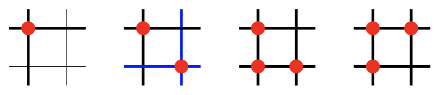

## 문제

The Bureau of Approved Peripherals for Computers (BAPC) is designing a new standard for computer keyboards. With every new norm and regulation, hardware becomes obsolete easily, so they require your services to write firmware for them.

A computer keyboard is an array of M rows and N columns of buttons. Every button has an associated probability. Furthermore, every column and every row of buttons has an associated cable, and every pressed button connects their row cable with their column cable (and vice versa!). The keyboard detects key presses by “sampling”. It sends an electric signal through the first row. This signal spreads to columns that are connected to it through pressed buttons on that column and to rows connected to these columns through other pressed buttons and so on. Every row or column that is connected, possibly indirectly, to the original row via pressed buttons receives the signal. The firmware stores which columns have received the signal. This process is repeated for every row.

It is easy to identify what was pressed if only one key was pressed. In this case only one pair (row, column) will make contact. But keyboards allow to press more than one key at the same time and unfortunately some combinations of key presses are impossible to tell apart. This phenomenon is called “ghosting”. For example, in a 2 × 2 keyboard, all combinations of three or four presses are impossible to tell apart, since every pair (row, column) makes electric contact (maybe indirectly), as can be seen in Figure 3.

Figure 3: Four examples of connected wires in a keyboard. Bold lines of the same colour indicate wires that are connected via pressed buttons, which are depicted as red dots. The two sets of pressed buttons on the right cannot be distinguished from each other, since they connect the same rows and columns.

The BAPC wants to deal with the problem of ghosting by finding the most likely combination of pressed keys that could have produced a particular set of signals.

## 입력

The input consists of

* A line containing two integers, M the number of rows of the keyboard and N the number of columns, with 1 ≤ M, N ≤ 500.
* M lines with N numbers each, where the j th number in the i th line indicates the probability 0 < p < 0.5 that the key in row i and column j is pressed. Here 0 ≤ i ≤ M − 1 and 0 ≤ j ≤ N − 1.
* M lines, each with an integer 0 ≤ k ≤ N and a list of k integers. The list of integers on the i th line indicates the columns that received the signal emitted by the i th row.

## 출력

Output the set of pressed keys that is most likely given the input. Any solution that achieves the maximum probability will be accepted. For each pressed key output a line with two integers r and c, separated by a space, indicating the row r and the column c of the key. The lines must be outputted in lexicographical order, that is, output first the keys whose row is lower and if the rows are the same output first the key whose column is lower.
