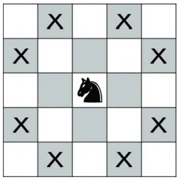

## 문제

After an exhausting battle, the invading army is finally defeated. The king sends his only surviving knight to the kingdom’s capital to tell the people of your victory. This might be a very (very!) long journey.

The knight moves as on a chessboard: in each move, he travels two squares in one of the four compass directions, and one more square sideways. During his journey, he must remain inside the kingdom to avoid starting any new wars. The kingdom is a NX × NY rectangular grid, which is possibly much (much!) larger than the 8 × 8 board on which the battle was fought. The rows and columns in this kingdom are numbered from 0. The knight starts at square KX, KY, and must travel to the capital at square CX, CY. Output the smallest number of moves in which the knight can reach the capital.

Figure 4: The possible moves for a knight.

## 입력

The input consists of three lines, each containing two integers:

* On the first line: NX, NY, the size of the kingdom, with 8 ≤ NX, NY ≤ 109.
* On the second line: KX, KY, the knight’s starting position, with 0 ≤ KX < NX and 0 ≤ KY < NY.
* On the third line: CX, CY, the position of the capital, with 0 ≤ CX < NX and 0 ≤ CY < NY.

## 출력

Output a single line containing a single integer, the number of moves the knight will need to get to the capital.
