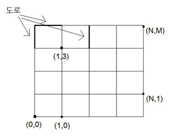

## 문제

세준이가 살고 있는 도시는 신기하게 생겼다. 이 도시는 격자형태로 생겼고, 직사각형이다. 도시의 가로 크기는 N이고, 세로 크기는 M이다. 또, 세준이의 집은 (0, 0)에 있고, 세준이의 학교는 (N, M)에 있다.

따라서, 아래 그림과 같이 생겼다.

세준이는 집에서 학교로 가는 길의 경우의 수가 총 몇 개가 있는지 궁금해지기 시작했다.

세준이는 항상 최단거리로만 가기 때문에, 항상 도로를 정확하게 N + M개 거친다. 하지만, 최근 들어 이 도시의 도로가 부실공사 의혹으로 공사중인 곳이 있다. 도로가 공사 중일 때는, 이 도로를 지날 수 없다.

(0, 0)에서 (N, M)까지 가는 서로 다른 경로의 경우의 수를 구하는 프로그램을 작성하시오.

## 입력

첫째 줄에 도로의 가로 크기 N과 세로 크기 M이 주어진다. N과 M은 100보다 작거나 같은 자연수이고, 둘째 줄에는 공사중인 도로의 개수 K가 주어진다. K는 0보다 크거나 같고, 50보다 작거나 같은 자연수이다. 셋째 줄부터 K개 줄에는 공사중인 도로의 정보가 a b c d와 같이 주어진다. a와 c는 0보다 크거나 같고, N보다 작거나 같은 자연수이고, b와 d는 0보다 크거나 같고, M보다 작거나 같은 자연수이다. 그리고, (a, b)와 (c, d)의 거리는 항상 1이다.

## 출력

첫째 줄에 (0, 0)에서 (N, M)까지 가는 경우의 수를 출력한다. 이 값은 0보다 크거나 같고, 263-1보다 작거나 같은 자연수이다.
