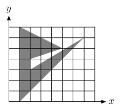

## 문제

아스키 아트란, 아스키 코드에 포함되는 문자, 기호를 사용한 그림을 말한다. 이 문제에서는 이를 좀 더 단순화한 경우를 생각해 보기로 한다.

직사각형 형태의 격자가 있다. 왼쪽 아래 꼭짓점의 좌표는 (0, 0)이고, 오른쪽 위 꼭짓점의 좌표는 (w, h)이다. 각 픽셀이란 (x, y) - (x+1, y+1) 로 이루어지는 한 변의 길이가 1인 정사각형을 말한다. (물론 여기서 0 ≤ x < w , 0 ≤ y < h이다.)

이러한 직사각형 격자 위에 다각형이 그려져 있다. 볼록 다각형은 아니지만, 자기 자신과 교차하거나 만나지 않는 단순 다각형이다. 이러한 다각형을 그리면 각 픽셀은 적절한 부분만 다각형 내부에 포함되게 된다. 예를 들어 아래 그림을 보자.

이제 우리는 각 픽셀을 하나의 아스키 코드 문자로 표현할 것이다. 단순히, 다각형 내부에 포함되어 있는 부분의 비율로만 판단하여, 다음과 같이 각각의 아스키 코드로 표현하기로 한다.

* 0%이상 25%미만 . (아스키 코드 번호 46)
* 25%이상 50%미만 + (아스키 코드 번호 43)
* 50%이상 75%미만 o (아스키 코드 번호 111)
* 75%이상 100%미만 \$ (아스키 코드 번호 36)
* 100% # (아스키 코드 번호 35)

문제에서 주어진 규칙에 따라 다각형의 아스키 아트를 구하는 프로그램을 작성하시오.

## 입력

첫째 줄에 n, w, h가 빈 칸을 사이에 두고 주어진다. n은 다각형의 꼭짓점의 개수이며 w와 h는 격자의 폭과 높이이다. 이어서 n개의 줄에는 다각형을 이루는 꼭짓점이 시계방향으로 주어진다. 정수 좌표 xi와 yi로 주어진다. (0 ≤ xi ≤ w, 0 ≤ yi ≤ h) 주어지는 n, w, h는 모두 100 이하의 자연수이다.

## 출력

h개 줄에 걸쳐 아스키 아트를 표현하는 w개의 문자를 출력한다.
