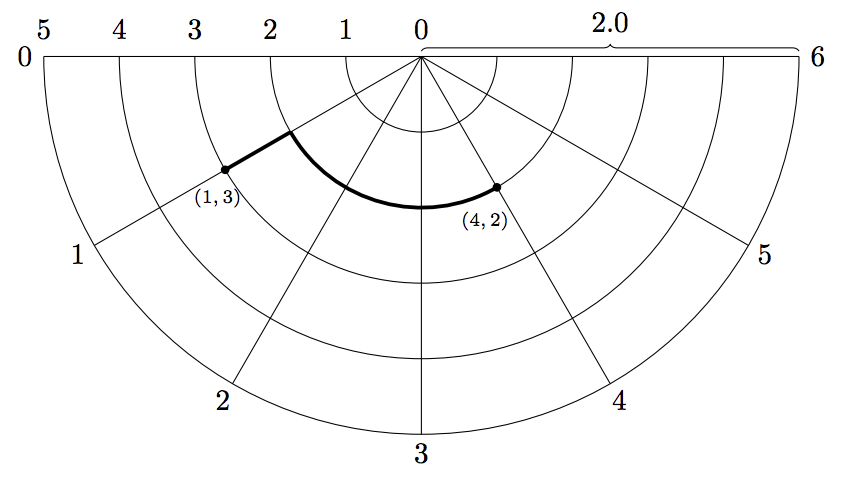

## 문제

Your friend from Manhattan is visiting you in Amsterdam. Because she can only stay for a short while, she wants to see as many tourist attractions in Amsterdam in as little time as possible. To do that, she needs to be able to figure out how long it takes her to walk from one landmark to another. In her hometown, that is easy: to walk from point m = (mx, my) to point n = (nx, ny) in Manhattan you need to walk a distance

|nx − mx| + |ny − my|,

since Manhattan looks like a rectangular grid of city blocks. However, Amsterdam is not well approximated by a rectangular grid. Therefore, you have taken it upon yourself to figure out the shortest distances between attractions in Amsterdam. With its canals, Amsterdam looks much more like a half-disc, with streets radiating at regular angles from the center, and with canals running the arc of the circle at equally spaced intervals. A street corner is given by the intersection of a circular canal and a street which radiates from the city center.

Figure 1: The first sample input.

Depending on how accurately you want to model the street plan of Amsterdam, you can split the city into more or fewer half rings, and into more or fewer segments. Also, to avoid conversion problems, you want your program to work with any unit, given as the radius of the half circle. Can you help your friend by writing a program which computes the distance between any two street corners in Amsterdam, for a particular approximation?

## 입력

The input consists of

* One line with two integers M, N and a floating point number R.
  + 1 ≤ M ≤ 100 is the number of segments (or ‘pie slices’) the model of the city is split into.
  + 1 ≤ N ≤ 100 is the number of half rings the model of the city is split into.
  + 1 ≤ R ≤ 1000 is the radius of the city.
* One line with four integers, ax, ay, bx, by, with 0 ≤ ax, bx ≤ M, and 0 ≤ ay, by ≤ N, the coordinates of two corners in the model of Amsterdam.

## 출력

Output a single line containing a single floating point number, the least distance needed to travel from point a to point b following only the streets in the model. The result should have an absolute or relative error of at most 10−6.
