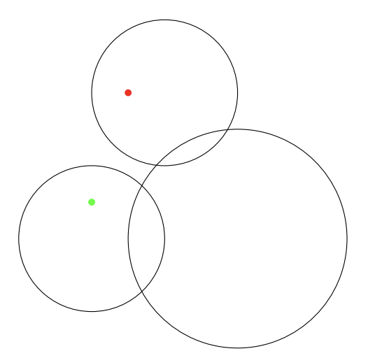

## 문제

Barney the polar has wandered off on an adventure. Lost in thought, he suddenly realizes he has strayed too far from his mother and is stuck on an ice shelf. He can still see her in the distance, but the only way back is by crossing a group of other ice shelves, all of which are perfectly circular. He is very scared, and can not swim. Barney’s mother, getting a little tired of her son’s shenanigans, decides to wait and let him figure this out for himself. Can you help Barney get home? He is in a hurry.

## 입력

* The first line of input contains four integers, −106 ≤ xb, yb, xm, ym ≤ 106, where (xb, yb) is Barney’s location and (xm, ym) is the location where Barney’s mom is waiting.
* The next line contains a single integer 1 ≤ n ≤ 25, the number of ice shelves.
* After this n lines follow. Each line holds three integers: −106 ≤ xi , yi ≤ 106 and 1 ≤ ri ≤ 106, the coordinates of the center of the shelf and its radius. A shelf consists of all points at distance ri or less to (xi, yi).

Both bears are on a shelf at the start of Barney’s journey home. Shelves can both touch and overlap.

## 출력

The minimal distance Barney has to travel to be reunited with his mother. The result should have a relative error of at most 10−6.

If there is no way for Barney to make it home, output “impossible”. (Do not worry about Barney’s well-being in this scenario. His mother will swim out to save him.)

## 힌트

Figure 2: Illustration of the third example input.
